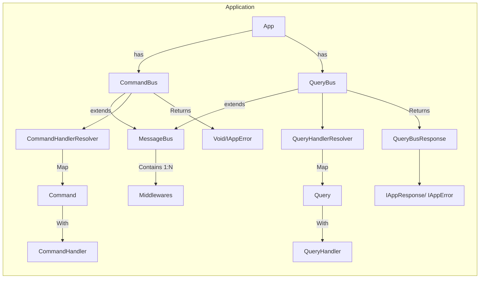
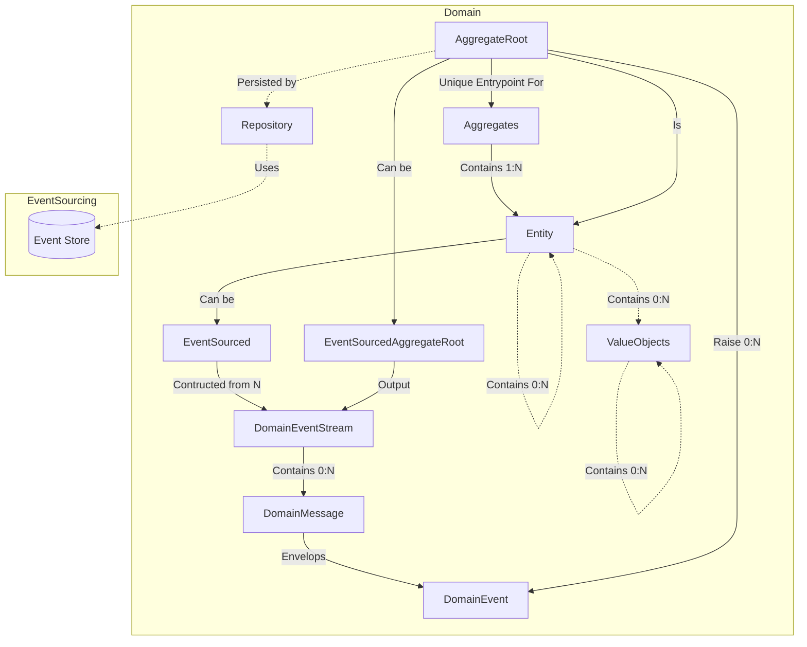
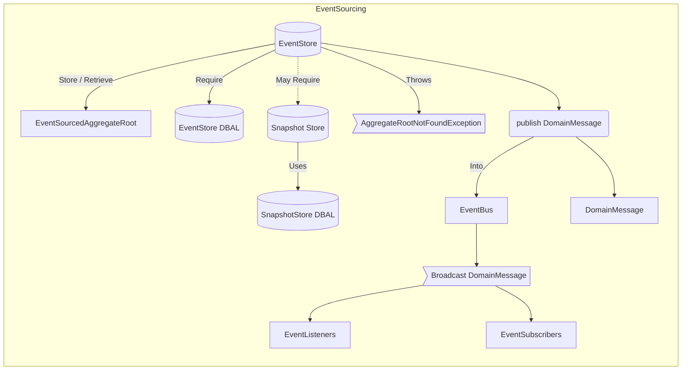
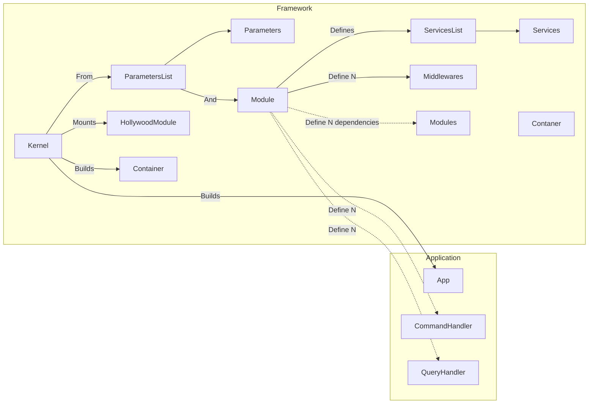
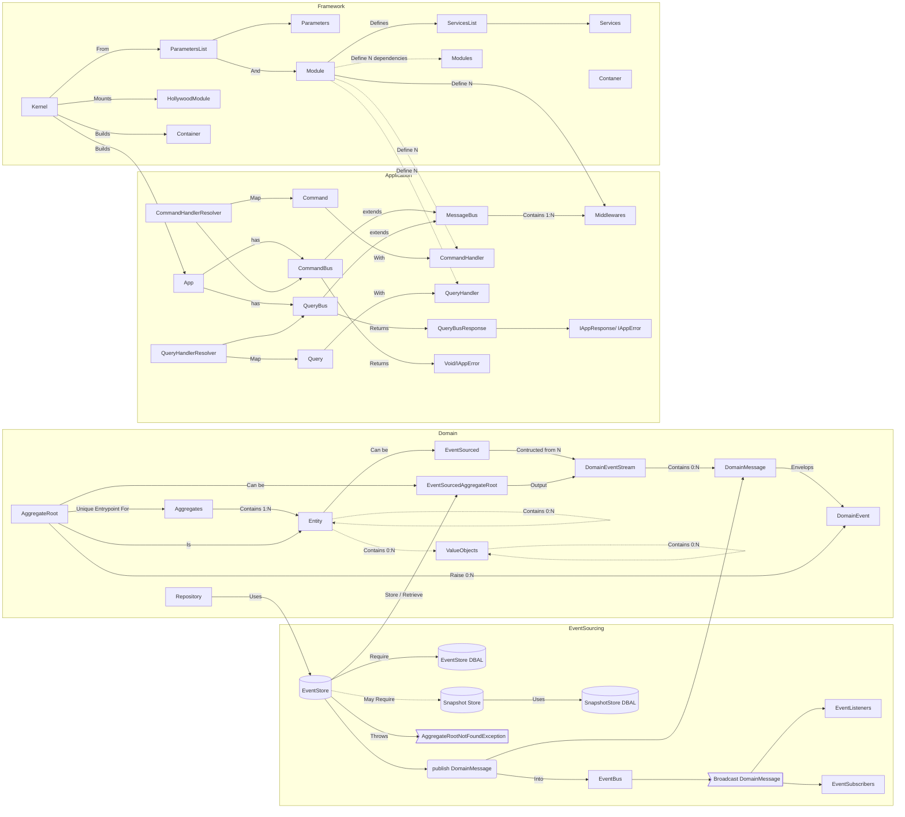
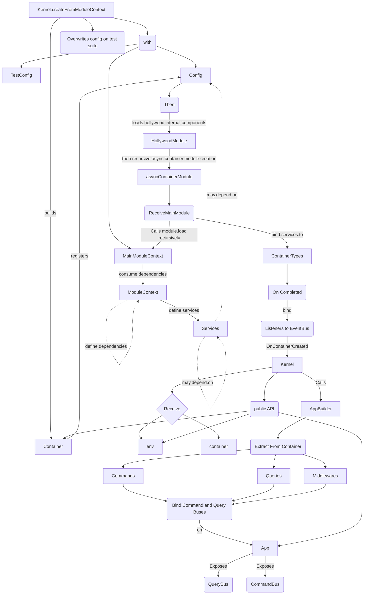

# Hollywood Architecture

Here an attempt to explain with graphs the Hollywood-js Components dependencies, boot and instantiation process.

# Components

## Application

## Domain

## EventSourcing

## Framework

## All together

## Instantiation process 

