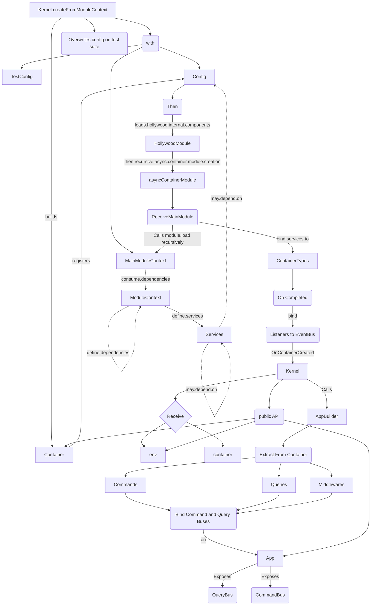

# Hollywood-js Architecture

Here is my attempt to explain the Hollywood-js boot and instantiation process.

```mermaid
graph TD
    testConf[TestConfig]
    conf[Config]
    c[Container]
    s[Services]
    mc[ModuleContext]
    mm[MainModuleContext]
    h[HollywoodModule]
    k[Kernel]
    kf[Kernel.createFromModuleContext]
    
    mc --> |define.services| s
    s -.-> |may.depend.on| s
    s -.-> |may.depend.on| conf
    mc -.-> |define.dependencies| mc

    mm -.-> |consume.dependencies| mc

    kf --> with(with)
    with --> conf
    with --> mm
    with --> testConf
    kf --> testSuite(Overwrites config on test suite)
    kf --> |builds| c
    c --> |registers| conf --> afterRegisterConf(Then) --> |loads.hollywood.internal.components| h
    h --> |then.recursive.async.container.module.creation| asyncContainerModule
    asyncContainerModule --> reveivesModule(ReceiveMainModule) --> |Calls module.load recursively| mm
    reveivesModule --> |bind.services.to| ContainerTypes
    ContainerTypes --> onCompleted(On Completed) --> |bind| Listeners(Listeners to EventBus)
    Listeners --> |OnContainerCreated| k
    
    k --> rec{Receive} --> env
    rec --> container
    k --> |Calls| AppBuilder
    AppBuilder --> ext(Extract From Container) 
    ext --> Commands
    ext --> Queries
    ext --> Middlewares
    Commands --> ThenBind(Bind Command and Query Buses)
    Queries --> ThenBind(Bind Command and Query Buses)
    Middlewares --> ThenBind(Bind Command and Query Buses)
    ThenBind --> |on| App --> |Exposes| ask(QueryBus)
    App --> |Exposes| handle(CommandBus)
    k --> kp(public API)
    kp --> c
    kp --> App
    kp --> env
    
```
