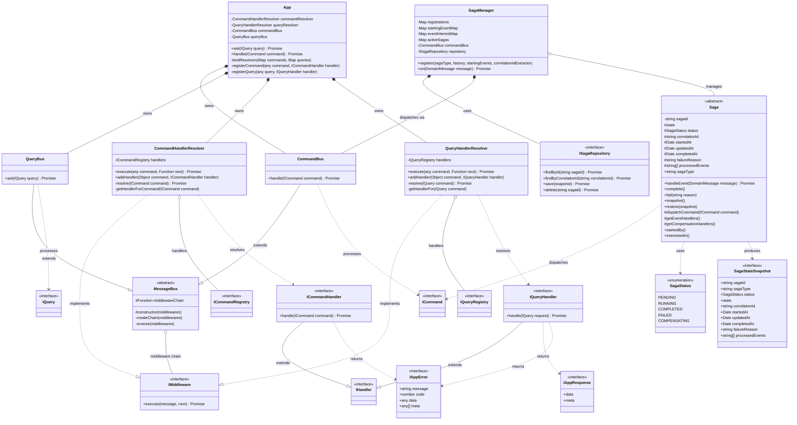

# Application Layer - CQRS Bounded Context

This document describes the Application Layer of the Hollywood-JS framework, which implements the Command Query Responsibility Segregation (CQRS) pattern.

**Version**: 6.0.0-beta

## Overview

The Application Layer provides the entry point for all use cases in the system. It separates read operations (Queries) from write operations (Commands) through dedicated bus implementations with middleware support.

### v6-beta Changes
- **Generic Middleware**: `IMiddleware<TMessage, TResponse>` for type-safe middleware
- **Type-safe Responses**: `IAppResponse<TData, TMeta>` with generic data and metadata types
- **Saga/Process Manager**: `Saga<TState>` and `SagaManager` for long-running workflows

## UML Class Diagram



## DDD Pattern Analysis

### Aggregate Root
- **App**: Serves as the Application Layer facade and aggregate root, coordinating all command and query operations

### Entities
- **Saga<TState>** (v6): Process manager for long-running workflows
  - Maintains internal state and status
  - Dispatches commands to progress workflow
  - Supports compensation for failure scenarios

### Value Objects
- **ICommand**: Immutable command message (marker interface)
- **IQuery**: Immutable query message (marker interface)
- **IAppResponse<TData, TMeta>** (v6): Generic typed response structure
- **IAppError**: Immutable error structure
- **ICommandRegistry**: Dictionary mapping command names to handlers
- **IQueryRegistry**: Dictionary mapping query names to handlers
- **SagaStateSnapshot<TState>** (v6): Saga persistence structure
- **SagaStatus** (v6): Enum of saga lifecycle states

### Domain Services
- **CommandBus**: Orchestrates command processing through middleware chain
- **QueryBus**: Orchestrates query processing through middleware chain
- **MessageBus**: Abstract base providing middleware chain functionality
- **CommandHandlerResolver**: Terminal middleware that resolves and invokes handlers
- **QueryHandlerResolver**: Terminal middleware that resolves and invokes handlers
- **SagaManager** (v6): Saga lifecycle management and event routing

### Interfaces (Ports)
- **IMiddleware<TMessage, TResponse>** (v6): Generic typed contract for middleware
- **ICommandHandler**: Contract for command handlers
- **IQueryHandler**: Contract for query handlers
- **IHandler**: Base handler contract
- **ISagaRepository** (v6): Contract for saga persistence

## Design Decisions

1. **Middleware Chain Pattern**: Both buses use a composable middleware chain allowing cross-cutting concerns (logging, validation, transactions) to be injected

2. **Resolver as Terminal Middleware**: The handler resolvers implement IMiddleware, allowing them to be the final step in the middleware chain

3. **Decorator-based Autowiring**: The `@autowiring` decorator extracts command/query types from handler method signatures for automatic registration

4. **v6: Generic Type-safe Middleware**: `IMiddleware<TMessage, TResponse>` provides compile-time type safety for message processing

5. **v6: Generic Type-safe Responses**: `IAppResponse<TData, TMeta>` allows typed data and metadata in query responses

6. **v6: Saga/Process Manager Pattern**: Sagas coordinate long-running processes across multiple aggregates:
   - Event-driven state transitions
   - Command dispatch for workflow progression
   - Compensation handlers for failure recovery
   - Idempotent event processing via processedEvents tracking

## Saga Pattern (v6)

```
1. Starting event arrives at SagaManager
2. SagaManager creates new saga instance (or loads existing)
3. Saga handles event and dispatches commands
4. Saga state persisted via ISagaRepository
5. Saga continues until complete() or fail() called
6. On failure: compensation handlers execute in reverse order
```

### Saga Example

```typescript
class OrderFulfillmentSaga extends Saga<OrderState> {
    readonly sagaType = 'OrderFulfillmentSaga';

    static startedBy(): string[] {
        return ['OrderPlaced'];
    }

    protected getEventHandlers(): Map<string, (event: any) => Promise<void>> {
        return new Map([
            ['OrderPlaced', this.onOrderPlaced.bind(this)],
            ['PaymentReceived', this.onPaymentReceived.bind(this)],
            ['ShipmentCreated', this.onShipmentCreated.bind(this)],
        ]);
    }

    protected getCompensationHandlers(): Map<string, () => Promise<void>> {
        return new Map([
            ['PaymentReceived', this.compensatePayment.bind(this)],
        ]);
    }

    private async onOrderPlaced(event: OrderPlaced): Promise<void> {
        this.state.orderId = event.orderId;
        this.dispatchCommand(new RequestPayment(event.orderId, event.amount));
    }

    private async onPaymentReceived(event: PaymentReceived): Promise<void> {
        this.state.paymentId = event.paymentId;
        this.dispatchCommand(new CreateShipment(this.state.orderId));
    }

    private async onShipmentCreated(event: ShipmentCreated): Promise<void> {
        this.complete();
    }

    private async compensatePayment(): Promise<void> {
        this.dispatchCommand(new RefundPayment(this.state.paymentId));
    }
}
```

## Cross-Context References

- Uses **Framework Layer** Container for dependency injection
- Handlers interact with **Domain Layer** Aggregate Roots
- Query handlers may interact with **Read Model Layer** repositories
- **SagaManager** extends **Event Sourcing Layer** EventListener to receive events
