# Complete System Architecture

This document provides comprehensive UML diagrams showing all Hollywood-JS framework components and their relationships across bounded contexts.

**Version**: 6.0.0-beta

## Full System Class Diagram

```mermaid
classDiagram
    %% =====================================================
    %% FRAMEWORK LAYER - Composition Root
    %% =====================================================
    namespace FrameworkLayer {
        class Kernel {
            <<AggregateRoot>>
            +string env
            +Container container
            +App app
            +Promise~Kernel~ createFromModuleContext(env, params, context)$
        }

        class ModuleContext {
            +ModuleContext[] modules
            +ModuleConfig config
            +Promise~void~ load(Container container)
        }

        class SERVICES_ALIAS {
            <<Constants>>
            +string COMMAND_HANDLERS$
            +string QUERY_HANDLERS$
            +string DEFAULT_EVENT_BUS$
            +string DEFAULT_EVENT_STORE_DBAL$
        }
    }

    %% =====================================================
    %% APPLICATION LAYER - CQRS + Saga (v6)
    %% =====================================================
    namespace ApplicationLayer {
        class App {
            <<AggregateRoot>>
            -CommandBus commandBus
            -QueryBus queryBus
            +Promise~void~ handle(ICommand command)
            +Promise~IAppResponse~ ask(IQuery query)
        }

        class MessageBus {
            <<abstract>>
            #Function middlewareChain
        }

        class CommandBus {
            +Promise~void~ handle(ICommand command)
        }

        class QueryBus {
            +Promise~QueryBusResponse~ ask(IQuery query)
        }

        class IMiddleware~TMessage,TResponse~ {
            <<interface>>
            +Promise~TResponse~ execute(message, next)
        }

        class CommandHandlerResolver {
            -ICommandRegistry handlers
            +execute(command, next)
        }

        class QueryHandlerResolver {
            -IQueryRegistry handlers
            +execute(command, next)
        }

        class ICommand {
            <<interface>>
        }

        class IQuery {
            <<interface>>
        }

        class ICommandHandler {
            <<interface>>
            +Promise~void~ handle(ICommand)
        }

        class IQueryHandler {
            <<interface>>
            +Promise~IAppResponse~ handle(IQuery)
        }

        class IAppResponse~TData,TMeta~ {
            <<ValueObject>>
            +TData data
            +TMeta[] meta
        }

        class IAppError {
            <<ValueObject>>
            +string message
            +number code
        }

        class Saga~TState~ {
            <<abstract>>
            -string sagaId
            #TState state
            #SagaStatus status
            +string sagaType
            +Promise~void~ handleEvent(DomainMessage message)
            +void complete()
            +void fail(string reason)
            #void dispatchCommand(ICommand command)
        }

        class SagaManager {
            -Map~string,SagaRegistration~ registrations
            -CommandBus commandBus
            -ISagaRepository repository
            +void register(sagaType, factory, startingEvents, correlationIdExtractor)
            +Promise~void~ on(DomainMessage message)
        }

        class SagaStatus {
            <<Enum>>
            PENDING
            RUNNING
            COMPLETED
            FAILED
            COMPENSATING
        }
    }

    %% =====================================================
    %% DOMAIN LAYER - Event Sourcing Core
    %% =====================================================
    namespace DomainLayer {
        class AggregateRoot {
            <<abstract>>
            -AggregateRootId aggregateRootId
            +AggregateRootId getAggregateRootId()
        }

        class EventSourcedAggregateRoot {
            <<AggregateRoot>>
            #Map~string,Function~ eventHandlers
            -number playhead
            -DomainMessage[] events
            -EventSourced[] children
            +DomainEventStream getUncommittedEvents()
            +fromHistory(DomainEventStream stream)
            +fromSnapshot(snapshot)
            #void registerHandler~T~(eventType, handler)
            #void raise(DomainEvent event)
        }

        class EventSourced {
            <<abstract>>
            -EventSourced[] children
            +fromSnapshot(snapshot)
            +recursiveHandling(event, method)
        }

        class IEventSourced {
            <<interface>>
            +fromSnapshot(snapshot)
            +recursiveHandling(event, method)
        }

        class DomainEvent {
            <<interface>>
            %% Marker interface - optional version field
        }

        class DomainMessage {
            <<ValueObject>>
            +AggregateRootId uuid
            +number playhead
            +DomainEvent event
            +Date occurred
            +string eventType
            +string idempotencyKey
            +DomainMessage create(uuid, playhead, event)$
        }

        class DomainEventStream {
            <<ValueObject>>
            +DomainMessage[] events
            +StreamName name
            +bool isEmpty()
        }

        class IRepository~T~ {
            <<interface>>
            +Promise~void~ save(T aggregateRoot)
            +Promise~T~ load(string id)
        }

        class Repository~T~ {
            <<abstract>>
            -EventStore~T~ eventStore
            +Promise~void~ save(T aggregateRoot)
            +Promise~T~ load(string id)
            +Promise~void~ saveWithRetry(id, updateFn, maxRetries)
        }

        class AggregateRootId {
            <<ValueObject>>
            string
        }

        class StreamName {
            <<ValueObject>>
            string
        }
    }

    %% =====================================================
    %% EVENT SOURCING LAYER - Infrastructure (v6 enhanced)
    %% =====================================================
    namespace EventSourcingLayer {
        class EventStore~T~ {
            <<AggregateRoot>>
            -IEventStoreDBAL dbal
            -EventBus eventBus
            -SnapshotStore~T~ snapshotStore
            -UpcasterChain upcasterChain
            +Promise~T~ load(AggregateRootId id)
            +Promise~void~ save(T entity)
            +Promise~void~ replayFrom(uuid, from, to)
        }

        class IEventStoreDBAL {
            <<interface>>
            +Promise~DomainEventStream~ load(id, from)
            +Promise~DomainEventStream~ loadFromTo(id, from, to)
            +void append(id, stream, expectedVersion)
            +AsyncIterator~DomainMessage~ loadAll(fromPosition)
        }

        class InMemoryEventStore {
            -Object events
            +load(aggregateId, from)
            +loadFromTo(aggregateId, from, to)
            +append(aggregateId, stream, expectedVersion)
            +loadAll(fromPosition)
        }

        class EventBus {
            -ISubscriberRegistry subscribersRegistry
            -IListenersRegistry listenersRegistry
            +Promise~void~ publish(DomainMessage message)
            +EventBus attach(event, EventSubscriber subscriber)
            +EventBus addListener(EventListener listener)
        }

        class DeadLetterAwareEventBus {
            -IDeadLetterQueue deadLetterQueue
            -RetryPolicy retryPolicy
            +Promise~void~ publish(DomainMessage message)
        }

        class IdempotentEventBus {
            -IIdempotencyStore idempotencyStore
            +Promise~void~ publish(DomainMessage message)
        }

        class UpcasterChain {
            -Map~string,EventUpcaster[]~ upcasters
            +void register~T~(EventUpcaster~T~ upcaster)
            +DomainEvent upcast(DomainEvent event)
        }

        class IEventListener {
            <<interface>>
            +void on(DomainMessage message)
        }

        class EventListener {
            <<abstract>>
            +void on(DomainMessage message)
        }

        class EventSubscriber {
            <<abstract>>
            #Map~string,Function~ handlers
            +Promise~void~ on(DomainMessage message)
            #void registerHandler~T~(eventType, handler)
        }

        class SnapshotStore~T~ {
            -ISnapshotStoreDBAL store
            +Promise~any~ retrieve(AggregateRootId id)
            +Promise~void~ snapshot(T entity)
        }

        class ISnapshotStoreDBAL {
            <<interface>>
            +Promise~any~ get(uuid)
            +Promise~void~ store(entity)
        }

        class InMemorySnapshotStoreDBAL {
            +snapshots
            +get(uuid)
            +store(entity)
        }

        class AggregateRootNotFoundException {
            <<Exception>>
        }

        class ConcurrencyException {
            <<Exception>>
            +string aggregateId
            +number expectedVersion
            +number actualVersion
        }

        class RetryPolicy {
            +RetryDecision evaluate(number retryCount)
            +RetryPolicy default()$
        }
    }

    %% =====================================================
    %% READ MODEL LAYER - Projections (v6 enhanced)
    %% =====================================================
    namespace ReadModelLayer {
        class Projector {
            <<type alias>>
        }

        class ProjectionManager {
            -IEventStoreDBAL eventStore
            -IProjectionPositionStore positionStore
            +Promise~void~ rebuild(Projector projector)
            +Promise~void~ catchUp(Projector projector)
        }

        class InMemoryReadModelRepository {
            -Object collection
            +void save(string id, any data)
            +any oneOrFail(string id)
            +any find(Function criteria)
        }
    }

    %% =====================================================
    %% INHERITANCE RELATIONSHIPS
    %% =====================================================
    EventSourcedAggregateRoot --|> AggregateRoot
    EventSourcedAggregateRoot ..|> IEventSourced
    EventSourced ..|> IEventSourced
    Repository ..|> IRepository

    CommandBus --|> MessageBus
    QueryBus --|> MessageBus
    CommandHandlerResolver ..|> IMiddleware
    QueryHandlerResolver ..|> IMiddleware

    InMemoryEventStore ..|> IEventStoreDBAL
    InMemorySnapshotStoreDBAL ..|> ISnapshotStoreDBAL
    EventListener ..|> IEventListener
    EventSubscriber ..|> IEventListener
    DeadLetterAwareEventBus --|> EventBus
    IdempotentEventBus --|> EventBus
    SagaManager --|> EventListener

    Projector --|> EventSubscriber

    %% =====================================================
    %% COMPOSITION RELATIONSHIPS
    %% =====================================================
    Kernel *-- App
    App *-- CommandBus
    App *-- QueryBus
    App *-- CommandHandlerResolver
    App *-- QueryHandlerResolver

    EventSourcedAggregateRoot *-- DomainMessage
    EventSourcedAggregateRoot *-- EventSourced
    DomainEventStream *-- DomainMessage

    EventStore *-- IEventStoreDBAL
    EventStore *-- EventBus
    EventStore *-- SnapshotStore
    EventStore *-- UpcasterChain
    SnapshotStore *-- ISnapshotStoreDBAL
    SagaManager *-- CommandBus

    %% =====================================================
    %% DEPENDENCY RELATIONSHIPS
    %% =====================================================
    Kernel ..> ModuleContext : builds from
    Repository ..> EventStore : uses
    EventStore ..> DomainEventStream : processes
    EventStore ..> EventSourcedAggregateRoot : manages
    EventStore ..> ConcurrencyException : throws
    EventBus ..> DomainMessage : publishes
    EventBus ..> Projector : notifies
    Projector ..> InMemoryReadModelRepository : updates
    ProjectionManager ..> Projector : rebuilds
    IQueryHandler ..> InMemoryReadModelRepository : queries
    ICommandHandler ..> Repository : uses
    SagaManager ..> Saga : manages
```

## Layer Dependency Flow

## Event Flow Sequence

## Query Flow Sequence

## Component Interaction Matrix

| Component | Creates | Uses | Is Used By |
|-----------|---------|------|------------|
| **Kernel** | App, Container | ModuleContext | Entry point |
| **App** | CommandBus, QueryBus | Handlers | Client code |
| **CommandBus** | - | Middleware chain | App, SagaManager |
| **QueryBus** | - | Middleware chain | App |
| **CommandHandler** | - | Repository | CommandBus |
| **QueryHandler** | - | ReadModelRepository | QueryBus |
| **Repository** | - | EventStore | Handlers |
| **EventStore** | - | DBAL, EventBus, SnapshotStore, UpcasterChain | Repository |
| **EventBus** | - | Subscribers, Listeners | EventStore |
| **DeadLetterAwareEventBus** | DeadLetterMessage | DLQ, RetryPolicy | EventStore (v6) |
| **IdempotentEventBus** | - | IdempotencyStore | EventStore (v6) |
| **UpcasterChain** | - | EventUpcasters | EventStore (v6) |
| **Projector** | - | ReadModelRepository | EventBus |
| **ProjectionManager** | - | EventStoreDBAL, PositionStore | Admin operations (v6) |
| **Saga** | Commands | State | SagaManager (v6) |
| **SagaManager** | Saga instances | CommandBus, SagaRepository | EventBus (v6) |
| **EventSourcedAggregateRoot** | DomainMessage | - | Repository, EventStore |

## Aggregate Boundaries

## Technology Integration Points

| Layer | Technology | Purpose |
|-------|------------|---------|
| Framework | Inversify | Dependency injection |
| Framework | reflect-metadata | Decorator metadata |
| Application | TypeScript | Type safety |
| Domain | ES6 Classes | OOP abstractions |
| Event Sourcing | Promise/async-await | Async operations |
| Read Model | In-memory objects | Simple storage |

## Extension Points

1. **Custom Middleware**: Implement `IMiddleware<TMessage, TResponse>` for command/query buses
2. **Custom DBAL**: Implement `IEventStoreDBAL` for different databases
3. **Custom Snapshot DBAL**: Implement `ISnapshotStoreDBAL` for snapshot storage
4. **Custom Projectors**: Extend `EventSubscriber` (Projector type alias) for read model updates
5. **Custom Listeners**: Extend `EventListener` for global event handling
6. **Custom Modules**: Create `ModuleContext` instances for feature modules
7. **Custom Event Upcasters** (v6): Implement `EventUpcaster<T>` for schema migrations
8. **Custom Dead Letter Queue** (v6): Implement `IDeadLetterQueue` for failed event storage
9. **Custom Idempotency Store** (v6): Implement `IIdempotencyStore` for duplicate detection
10. **Custom Saga Repository** (v6): Implement `ISagaRepository` for saga persistence
11. **Custom Projection Position Store** (v6): Implement `IProjectionPositionStore` for rebuild tracking
12. **Custom Sagas** (v6): Extend `Saga<TState>` for workflow orchestration
