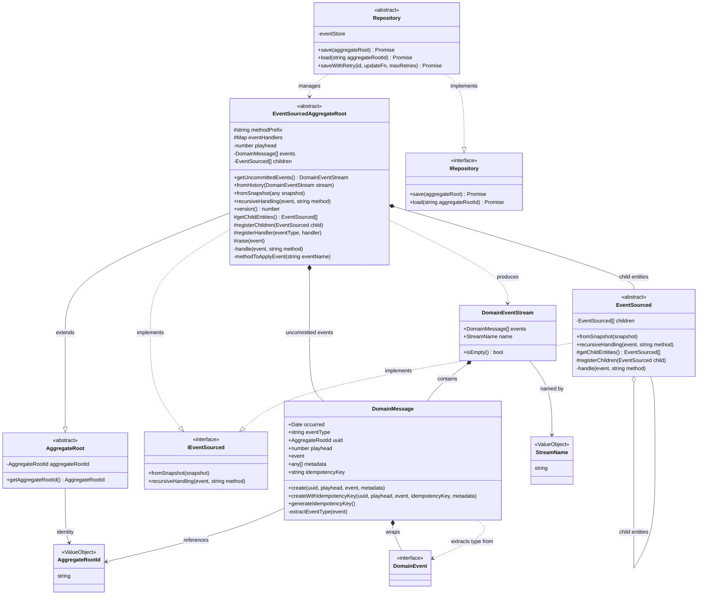

# Domain Layer - Event Sourcing Bounded Context

This document describes the Domain Layer of the Hollywood-JS framework, which implements Event Sourcing patterns for aggregate state management.

**Version**: 6.0.0-beta

## Overview

The Domain Layer provides the building blocks for Domain-Driven Design with Event Sourcing support. It includes aggregate roots, entities, domain events, and event streams that capture all state changes as an immutable sequence of events.

### v6-beta Changes
- **DomainEvent is now an interface** (not abstract class) for better composition
- **Explicit handler registration** in EventSourcedAggregateRoot and EventSubscriber
- **Repository retry support** for optimistic locking conflicts
- **Idempotency key** added to DomainMessage

## UML Class Diagram



## DDD Pattern Analysis

### Aggregate Root
- **EventSourcedAggregateRoot**: The primary aggregate root for event-sourced domains
  - Maintains a playhead (version) for optimistic concurrency
  - Collects uncommitted events until persisted
  - Supports hierarchical event handling through child entities
  - Can be reconstituted from history or snapshot
  - **v6**: Supports explicit handler registration via `registerHandler()` method

### Entities
- **EventSourced**: Base class for entities within an aggregate that participate in event sourcing
  - Receives events recursively from the aggregate root
  - Maintains its own child entity hierarchy
  - Supports snapshot restoration

### Value Objects
- **AggregateRootId**: Type alias for string UUID - uniquely identifies an aggregate
- **StreamName**: Type alias for string - identifies an event stream (defaults to "master")
- **DomainEvent**: **Interface** (v6 change from abstract class) for domain events
  - Allows events to be plain data objects without inherited behavior
  - Optional `version` field for event versioning (defaults to 1)
- **DomainMessage**: Envelope containing event metadata
  - timestamp, playhead, aggregate ID
  - **v6**: `idempotencyKey` for duplicate prevention
- **DomainEventStream**: Collection of domain messages with stream identification

### Repository (Port)
- **IRepository<T>**: Interface defining the contract for aggregate persistence
- **Repository<T>**: Abstract implementation delegating to EventStore
  - **v6**: `saveWithRetry()` method for handling optimistic locking conflicts

## Event Sourcing Mechanics

### Raising Events
```
raise(event) ->
  1. Create DomainMessage with playhead and timestamp
  2. Apply event to self and all children recursively
  3. Increment playhead
  4. Add message to uncommitted events
```

### Reconstituting from History
```
fromHistory(stream) ->
  1. For each message in stream:
     - Increment playhead
     - Apply event recursively to self and children
  2. Return reconstituted aggregate
```

### Method Naming Convention
Events are applied via methods named `apply{EventClassName}`. For example:
- `UserCreated` event -> `applyUserCreated(event)` method

**v6 Preferred Approach**: Explicit handler registration:
```typescript
class User extends EventSourcedAggregateRoot {
    constructor(id: string) {
        super(id);
        this.registerHandler(UserCreated, this.applyUserCreated.bind(this));
    }

    private applyUserCreated(event: UserCreated): void {
        this.email = event.email;
    }
}
```

When handlers are registered explicitly, the aggregate operates in "strict mode" - attempting to apply an event without a registered handler throws an error. The legacy `apply*` method pattern is still supported for backwards compatibility when no handlers are registered.

## Design Decisions

1. **Immutable Event Stream**: Events once committed cannot be modified, ensuring audit trail integrity

2. **Recursive Event Handling**: Child entities automatically receive events, enabling complex aggregate hierarchies

3. **Snapshot Support**: Long-lived aggregates can be snapshot to optimize reconstitution

4. **Metadata Support**: DomainMessage includes metadata array for correlation IDs, causation IDs, etc.

5. **Type Extraction**: Event type is derived from constructor name, enabling dynamic dispatch

6. **v6: DomainEvent as Interface**: Changed from abstract class to interface to:
   - Allow events to be plain data objects
   - Support extending other classes if needed
   - Avoid forcing inheritance on event definitions

7. **v6: Explicit Handler Registration**: Replaces reflection-based method lookup with explicit registration for:
   - Better type safety
   - Clearer intent
   - Easier refactoring
   - Strict mode prevents silent failures

8. **v6: Idempotency Keys**: DomainMessage includes idempotency key for duplicate detection at the infrastructure level

9. **v6: Repository Retry**: `saveWithRetry()` automatically handles optimistic locking conflicts with configurable retry count

## Cross-Context References

- **Repository** depends on **Event Sourcing Layer** EventStore for persistence
- **DomainMessage** is consumed by **Event Sourcing Layer** EventBus for publishing
- Aggregates are loaded/saved via **Application Layer** command handlers
