# Event Sourcing Layer - Infrastructure Bounded Context

This document describes the Event Sourcing Layer of the Hollywood-JS framework, which provides the infrastructure for persisting and distributing domain events.

**Version**: 6.0.0-beta

## Overview

The Event Sourcing Layer implements the persistence and publication mechanisms for event-sourced aggregates. It includes the EventStore for event persistence, EventBus for event distribution, and SnapshotStore for aggregate state caching.

### v6-beta Changes
- **Event Versioning and Upcasting**: UpcasterChain for event schema evolution
- **Dead Letter Queue**: DeadLetterAwareEventBus with RetryPolicy for failed event handling
- **Idempotency**: IdempotentEventBus and IIdempotencyStore for duplicate prevention
- **Optimistic Locking**: ConcurrencyException and version-based conflict detection
- **EventSubscriber explicit registration**: `registerHandler()` for type-safe event handling

## UML Class Diagram

```mermaid
classDiagram
    namespace EventSourcingLayer {
        %% Event Store (Aggregate Root of Infrastructure Context)
        class EventStore~T~ {
            <<AggregateRoot>>
            -IEventStoreDBAL dbal
            -EventBus eventBus
            -SnapshotStore~T~ snapshotStore
            -UpcasterChain upcasterChain
            -AggregateFactory~T~ modelConstructor
            -number snapshotMargin
            +Promise~T~ load(AggregateRootId aggregateRootId)
            +Promise~void~ save(T entity)
            +Promise~void~ append(AggregateRootId aggregateId, DomainEventStream stream)
            +Promise~void~ replayFrom(AggregateRootId uuid, number from, number to)
            -Promise~void~ takeSnapshot(T entity)
            -bool isSnapshotNeeded(number version)
            -Promise~T|null~ fromSnapshot(AggregateRootId aggregateRootId)
            -T aggregateFactory(AggregateRootId aggregateRootId)
            -DomainEventStream upcastStream(DomainEventStream stream)
        }

        class AggregateFactory~T~ {
            <<TypeAlias>>
            new(AggregateRootId) T
        }

        %% Event Store DBAL Interface (Port)
        class IEventStoreDBAL {
            <<interface>>
            +Promise~DomainEventStream~ load(AggregateRootId aggregateId, number from)
            +Promise~DomainEventStream~ loadFromTo(AggregateRootId aggregateId, number from, number to)
            +void|Promise~any~ append(AggregateRootId aggregateId, DomainEventStream stream, number expectedVersion)
            +AsyncIterator~DomainMessage~ loadAll(number fromPosition)
        }

        %% In-Memory Implementation (Adapter)
        class InMemoryEventStore {
            -Object events
            -number globalPosition
            +Promise~DomainEventStream~ load(string aggregateId, number from)
            +Promise~DomainEventStream~ loadFromTo(string aggregateId, number from, number to)
            +void append(string aggregateId, DomainEventStream stream, number expectedVersion)
            +AsyncIterator~DomainMessage~ loadAll(number fromPosition)
        }

        %% Event Bus
        class EventBus {
            -ISubscriberRegistry subscribersRegistry
            -IListenersRegistry listenersRegistry
            +Promise~void~ publish(DomainMessage message)
            +EventBus attach(any event, EventSubscriber subscriber)
            +EventBus addListener(EventListener listener)
            -EventSubscriber[] subscribersFor(string eventType)
        }

        %% Dead Letter Queue (v6)
        class DeadLetterAwareEventBus {
            -IDeadLetterQueue deadLetterQueue
            -RetryPolicy retryPolicy
            +Promise~void~ publish(DomainMessage message)
            +DeadLetterAwareEventBus attach(event, subscriber)
            +DeadLetterAwareEventBus addListener(listener)
            -Promise~void~ safeExecute(fn, message, handlerName)
        }

        class IDeadLetterQueue {
            <<interface>>
            +Promise~void~ enqueue(DeadLetterMessage message)
            +Promise~DeadLetterMessage[]~ dequeue(number limit)
            +Promise~number~ size()
        }

        class DeadLetterMessage {
            +string id
            +DomainMessage originalMessage
            +string handlerName
            +Error error
            +number retryCount
            +Date failedAt
            +Date nextRetryAt
        }

        class RetryPolicy {
            -RetryPolicyConfig config
            +RetryDecision evaluate(number currentRetryCount)
            +RetryPolicy default()$
            +RetryPolicy noRetry()$
        }

        %% Idempotency (v6)
        class IdempotentEventBus {
            -IIdempotencyStore idempotencyStore
            -IdempotentEventBusOptions options
            +Promise~void~ publish(DomainMessage message)
        }

        class IIdempotencyStore {
            <<interface>>
            +Promise~bool~ exists(string key)
            +Promise~void~ mark(string key, number ttl)
            +Promise~void~ remove(string key)
        }

        class InMemoryIdempotencyStore {
            -Map~string,IdempotencyEntry~ store
            +Promise~bool~ exists(string key)
            +Promise~void~ mark(string key, number ttl)
            +Promise~void~ remove(string key)
        }

        %% Event Upcasting (v6)
        class UpcasterChain {
            -Map~string,EventUpcaster[]~ upcasters
            +void register~T~(EventUpcaster~T~ upcaster)
            +DomainEvent upcast(DomainEvent event)
            +number getLatestVersion(string eventType)
            +bool hasUpcasters(string eventType)
        }

        class EventUpcaster~T~ {
            <<interface>>
            +string eventType
            +number fromVersion
            +number toVersion
            +T upcast(T event)
        }

        %% Event Listener Contracts
        class IEventListener {
            <<interface>>
            +void on(DomainMessage message)
        }

        class EventListener {
            <<abstract>>
            +Promise~void~|void on(DomainMessage message)
        }

        class EventSubscriber {
            <<abstract>>
            #Map~string,Function~ handlers
            +Promise~void~ on(DomainMessage message)
            #void registerHandler~T~(eventType, handler)
        }

        %% Subscriber Registry (Value Object)
        class ISubscriberRegistry {
            <<interface>>
            +EventSubscriber[] [key: string]
        }

        class IListenersRegistry {
            <<interface>>
            +EventListener [key: string]
        }

        %% Snapshot Store
        class SnapshotStore~T~ {
            -ISnapshotStoreDBAL store
            +Promise~any~ retrieve(AggregateRootId aggregateRootId)
            +Promise~void~ snapshot(T entity)
        }

        %% Snapshot DBAL Interface (Port)
        class ISnapshotStoreDBAL {
            <<interface>>
            +Promise~any|null~ get(AggregateRootId uuid)
            +Promise~void~ store(EventSourcedAggregateRoot entity)
        }

        %% In-Memory Snapshot Implementation (Adapter)
        class InMemorySnapshotStoreDBAL {
            +ISnapshotDictionary snapshots
            +Promise~EventSourcedAggregateRoot|null~ get(AggregateRootId uuid)
            +Promise~void~ store(EventSourcedAggregateRoot entity)
        }

        %% Exceptions
        class AggregateRootNotFoundException {
            <<Exception>>
        }

        class ConcurrencyException {
            <<Exception>>
            +string aggregateId
            +number expectedVersion
            +number actualVersion
        }
    }

    %% Import from Domain Layer
    namespace DomainLayer {
        class DomainMessage {
            +string eventType
            +AggregateRootId uuid
            +string idempotencyKey
        }
        class DomainEventStream {
            +DomainMessage[] events
        }
        class EventSourcedAggregateRoot {
            <<AggregateRoot>>
        }
        class AggregateRootId {
            <<ValueObject>>
        }
    }

    %% Implementation Relationships
    InMemoryEventStore ..|> IEventStoreDBAL : implements
    InMemorySnapshotStoreDBAL ..|> ISnapshotStoreDBAL : implements
    InMemoryIdempotencyStore ..|> IIdempotencyStore : implements
    EventListener ..|> IEventListener : implements
    EventSubscriber ..|> IEventListener : implements
    DeadLetterAwareEventBus --|> EventBus : extends
    IdempotentEventBus --|> EventBus : extends

    %% Composition Relationships
    EventStore *-- IEventStoreDBAL : uses
    EventStore *-- EventBus : publishes to
    EventStore *-- SnapshotStore : optional
    EventStore *-- UpcasterChain : upcasts with
    EventStore *-- AggregateFactory : creates with
    SnapshotStore *-- ISnapshotStoreDBAL : uses
    EventBus *-- ISubscriberRegistry : manages
    EventBus *-- IListenersRegistry : manages
    DeadLetterAwareEventBus *-- IDeadLetterQueue : uses
    DeadLetterAwareEventBus *-- RetryPolicy : uses
    IdempotentEventBus *-- IIdempotencyStore : uses

    %% Dependencies
    EventStore ..> DomainEventStream : loads/appends
    EventStore ..> EventSourcedAggregateRoot : manages
    EventStore ..> AggregateRootNotFoundException : throws
    EventStore ..> ConcurrencyException : throws
    EventBus ..> DomainMessage : publishes
    EventBus ..> EventSubscriber : notifies
    EventBus ..> EventListener : notifies
    SnapshotStore ..> EventSourcedAggregateRoot : snapshots
    InMemoryEventStore ..> DomainMessage : stores
    UpcasterChain ..> EventUpcaster : chains
```



## DDD Pattern Analysis

### Aggregate Root (Infrastructure Context)
- **EventStore<T>**: Primary aggregate coordinating event persistence and publication
  - Orchestrates DBAL, EventBus, and SnapshotStore
  - Implements event replay for projections
  - Manages snapshot strategy
  - **v6**: Integrates UpcasterChain for event version migration

### Entities
- **SnapshotStore<T>**: Entity managing snapshot lifecycle
- **EventBus**: Entity managing event distribution
- **UpcasterChain** (v6): Entity managing event version migrations

### Value Objects
- **ISubscriberRegistry**: Dictionary of event type to subscriber arrays
- **IListenersRegistry**: Dictionary of listener names to instances
- **ISnapshotDictionary**: Dictionary of aggregate IDs to snapshots
- **AggregateFactory<T>**: Constructor type for aggregate instantiation
- **DeadLetterMessage** (v6): Failed event envelope with retry metadata
- **RetryDecision** (v6): Result of retry policy evaluation
- **EventUpcaster<T>** (v6): Version transformation definition

### Interfaces (Ports)
- **IEventStoreDBAL**: Database abstraction for event persistence
  - **v6**: `append()` now accepts `expectedVersion` for optimistic locking
  - **v6**: `loadAll()` for streaming all events (projection rebuild)
- **ISnapshotStoreDBAL**: Database abstraction for snapshot persistence
- **IEventListener**: Base contract for event consumers
- **IIdempotencyStore** (v6): Duplicate detection storage
- **IDeadLetterQueue** (v6): Failed event storage

### Infrastructure Implementations (Adapters)
- **InMemoryEventStore**: In-memory DBAL for testing
  - **v6**: Implements version checking for optimistic locking
- **InMemorySnapshotStoreDBAL**: In-memory snapshot storage for testing
- **InMemoryIdempotencyStore** (v6): In-memory idempotency with TTL support
- **InMemoryDeadLetterQueue** (v6): In-memory dead letter queue

### Domain Services
- **EventListener**: Abstract base for listeners that receive all events
- **EventSubscriber**: Abstract base for subscribers with event-specific handlers
  - **v6**: Supports explicit handler registration via `registerHandler()`
- **DeadLetterAwareEventBus** (v6): EventBus with DLQ integration
- **IdempotentEventBus** (v6): EventBus with duplicate prevention
- **RetryPolicy** (v6): Exponential backoff configuration

### Exceptions
- **AggregateRootNotFoundException**: Thrown when aggregate not found
- **ConcurrencyException** (v6): Thrown on version conflicts

## Event Flow

```
1. CommandHandler calls Repository.save(aggregate)
2. Repository delegates to EventStore.save(aggregate)
3. EventStore:
   a. Gets uncommitted events from aggregate
   b. Appends to DBAL with expectedVersion for optimistic locking (v6)
   c. Takes snapshot if needed
   d. Publishes each event to EventBus
4. EventBus (or DeadLetterAwareEventBus/IdempotentEventBus):
   a. Finds subscribers for event type
   b. Notifies each subscriber (with retry/DLQ support in v6)
   c. Notifies all listeners
```

## Event Load Flow (with Upcasting)

```
1. Repository calls EventStore.load(aggregateId)
2. EventStore:
   a. Checks for snapshot
   b. Loads events from DBAL (from snapshot version or 0)
   c. Upcasts each event through UpcasterChain (v6)
   d. Reconstitutes aggregate from history
3. Returns hydrated aggregate
```

## Subscriber vs Listener Pattern

### EventSubscriber
- Receives specific events based on registration
- **v6 Preferred**: Explicit handler registration via `registerHandler()`
- **Legacy**: Method dispatch `on{EventType}(event)` still supported
- Used for projections and specific event handling

### EventListener
- Receives ALL events
- Single entry point: `on(message)`
- Used for logging, auditing, general event processing

## Dead Letter Queue Pattern (v6)

```
1. Event published to DeadLetterAwareEventBus
2. Handler throws exception
3. RetryPolicy evaluated:
   a. If retries remaining: wait with backoff, retry
   b. If max retries exceeded: send to DeadLetterQueue
4. DeadLetterQueue stores:
   - Original message
   - Handler name
   - Error details
   - Retry count
   - Failed timestamp
```

## Idempotency Pattern (v6)

```
1. Event published to IdempotentEventBus
2. Check idempotencyKey in store:
   a. If exists: skip (optionally call onDuplicate callback)
   b. If not exists: mark as processing
3. Process event through handlers
4. If error: remove key to allow retry
```

## Event Upcasting Pattern (v6)

```
1. Register upcasters for each version transition:
   - UserCreated v1 -> v2: add email field
   - UserCreated v2 -> v3: add timestamp field
2. On load, events are automatically migrated:
   - v1 event -> upcaster chain -> v3 event
3. Upcasters are applied in sequence based on fromVersion
```

## Snapshot Strategy

The EventStore takes snapshots based on:
1. Snapshot margin (default: 10 events)
2. Version divisibility: `version % margin === 0`
3. Non-zero version to avoid empty snapshots

## Design Decisions

1. **DBAL Pattern**: Database abstraction layer allows swapping storage implementations

2. **Fluent EventBus API**: `attach()` and `addListener()` return `this` for chaining

3. **Generic EventStore**: Typed with aggregate constructor for type-safe instantiation

4. **Optional Snapshotting**: SnapshotStore is optional, enabling simple use cases

5. **Async Event Publication**: Events are published sequentially to maintain ordering

6. **v6: Optimistic Locking**: `append()` accepts `expectedVersion` to detect concurrent modifications. `ConcurrencyException` thrown on conflicts.

7. **v6: Event Upcasting**: UpcasterChain integrates with EventStore.load() for transparent version migration. Events are upcasted before aggregate reconstitution.

8. **v6: Dead Letter Queue**: DeadLetterAwareEventBus provides resilient event handling with configurable retry policies and exponential backoff.

9. **v6: Idempotency at Bus Level**: IdempotentEventBus uses idempotencyKey from DomainMessage for bus-level duplicate prevention.

10. **v6: Explicit Handler Registration**: EventSubscriber supports `registerHandler()` for type-safe, explicit event routing. Legacy `on{EventType}` methods still work for backwards compatibility.

11. **v6: Streaming for Projections**: `IEventStoreDBAL.loadAll()` returns an async iterator for efficient projection rebuilds.

## Cross-Context References

- **EventStore** uses **Domain Layer** DomainEventStream and EventSourcedAggregateRoot
- **Repository** from **Domain Layer** depends on EventStore
- **Projector** from **Read Model Layer** extends EventSubscriber
- **ProjectionManager** from **Read Model Layer** uses `loadAll()` for rebuilds (v6)
- **Framework Layer** configures DBAL implementations via DI container
