# Framework Layer - Dependency Injection Bounded Context

This document describes the Framework Layer of the Hollywood-JS framework, which provides the application bootstrapping, dependency injection container, and module system.

**Version**: 6.0.0-beta

## Overview

The Framework Layer implements the composition root for Hollywood-JS applications. It provides a modular architecture built on Inversify for dependency injection, with support for service registration, parameter binding, and module composition.

### v6-beta Changes
- **TypeScript 5.9**: Updated to latest TypeScript with enhanced type inference
- **ESLint 9**: Replaced TSLint with modern ESLint configuration
- **Jest 30**: Updated testing framework
- **Node.js 20/22 LTS**: Support for current LTS versions

## UML Class Diagram

```mermaid
classDiagram
    class Kernel {
        +string env
        +Container container
        +App app
        +createFromModuleContext(env, parameters, moduleContext, testParameters) Promise
        -overwriteParamsOnTest(env, parameters, testParameters)
    }

    class ModuleContext {
        +ModuleContext[] modules
        +ModuleConfig config
        +load(Container container) Promise
        +addFirstModuleContext(ModuleContext module)
        -mergeModuleDependenciesConfig()
        -getServices()
        -bindCommands(commands)
    }

    class ModuleConfig {
        <<interface>>
        +any[] commands
        +any[] queries
        +ServiceList services
        +ModuleContext[] modules
    }

    class HollywoodModule {
        <<Factory>>
        +invoke() ModuleContext
    }

    class AppBuilder {
        <<Factory>>
        +invoke(Container container) App
    }

    class BuildFromModuleContext {
        <<Factory>>
        +invoke(parameters, moduleContext) Promise
    }

    class IService {
        <<interface>>
        +any instance
        +any[] collection
        +Function custom
        +eventStore
        +Function async
        +bool constant
        +bool overwrite
        +string bus
        +bool listener
        +any[] subscriber
    }

    class ServiceList {
        <<ValueObject>>
    }

    class StandardType {
        +invoke(rebind, isBound, bind)
    }

    class CollectionType {
        +invoke(bind, unbind, isBound)
        +IsCollectionType(service) bool
    }

    class AsyncType {
        +invoke(rebind, isBound, bind) Promise
        +IsAsyncType(service) bool
    }

    class CustomType {
        +invoke(rebind, isBound, bind)
        +IsCustomType(service) bool
    }

    class EventStoreType {
        +invoke(rebind, isBound, bind)
        +IsEventStoreType(service) bool
    }

    class ListenerType {
        +invoke(bind, rebind, isBound)
        +IsListenerType(service) bool
    }

    class Parameter {
        <<ValueObject>>
    }

    class ParametersList {
        <<ValueObject>>
    }

    class UniqueParameterIdentifier {
        <<ValueObject>>
        string
    }

    class SERVICES_ALIAS {
        <<Constants>>
        +string COMMAND_HANDLERS
        +string QUERY_HANDLERS
        +string COMMAND_MIDDLEWARE
        +string QUERY_MIDDLEWARE
        +string DEFAULT_EVENT_BUS
        +string DEFAULT_EVENT_STORE_DBAL
        +string DEFAULT_EVENT_STORE_SNAPSHOT
        +string DEFAULT_EVENT_STORE_SNAPSHOT_DBAL
    }

    class PARAMETERS_ALIAS {
        <<Constants>>
        +string DEFAULT_EVENT_STORE_MARGIN
    }

    class parametersBinder {
        <<Factory>>
        +invoke(container, parameters)
    }

    class createContainerModule {
        <<Factory>>
        +invoke(serviceList) AsyncContainerModule
    }

    class Container {
        +loadAsync(module)
        +getAll(identifier)
    }

    class AsyncContainerModule {
    }

    class App {
    }

    class ICommandHandler {
        <<interface>>
    }

    class IQueryHandler {
        <<interface>>
    }

    class IMiddleware {
        <<interface>>
    }

    HollywoodModule ..> ModuleContext : creates

    Kernel *-- Container : owns
    Kernel *-- App : owns
    ModuleContext *-- ModuleConfig : configured by
    ModuleContext *-- ModuleContext : nested modules
    ModuleConfig *-- ServiceList : defines

    Kernel ..> ModuleContext : builds from
    Kernel ..> AppBuilder : uses
    Kernel ..> BuildFromModuleContext : uses
    AppBuilder ..> App : creates
    AppBuilder ..> Container : reads from
    BuildFromModuleContext ..> ModuleContext : loads
    BuildFromModuleContext ..> Container : creates
    BuildFromModuleContext ..> parametersBinder : uses
    BuildFromModuleContext ..> HollywoodModule : prepends
    ModuleContext ..> createContainerModule : uses
    createContainerModule ..> StandardType : delegates
    createContainerModule ..> CollectionType : delegates
    createContainerModule ..> AsyncType : delegates
    createContainerModule ..> CustomType : delegates
    createContainerModule ..> EventStoreType : delegates
    createContainerModule ..> ListenerType : delegates
```



## DDD Pattern Analysis

### Aggregate Root
- **Kernel**: The composition root and aggregate root of the Framework context
  - Coordinates container creation and app building
  - Manages environment-specific configuration
  - Provides the entry point for application bootstrap

### Entities
- **ModuleContext**: Encapsulates module configuration and dependencies
  - Supports hierarchical module composition
  - Manages service list merging from dependencies

### Value Objects
- **ModuleConfig**: Configuration structure for modules
- **IService**: Service definition structure
- **ServiceList**: Map of service identifiers to definitions
- **ParametersList**: Map of parameter identifiers to values
- **Parameter**: Union type for configuration values
- **SERVICES_ALIAS**: Constants for service identifiers
- **PARAMETERS_ALIAS**: Constants for parameter identifiers

### Factories
- **HollywoodModule**: Factory function creating the base module context
- **AppBuilder**: Factory function creating the App from container
- **BuildFromModuleContext**: Factory function creating the container from modules
- **createContainerModule**: Factory creating Inversify async modules
- **parametersBinder**: Factory binding parameters to container

### Service Type Strategies
- **StandardType**: Default service binding (singleton instances)
- **CollectionType**: Multi-binding for arrays (handlers, middleware)
- **AsyncType**: Async factory-based service creation
- **CustomType**: Custom factory function binding
- **EventStoreType**: EventStore-specific binding with DBAL injection
- **ListenerType**: Event listener/subscriber registration

## Module Composition

```
Kernel.createFromModuleContext(env, params, appModule)
  |
  +-> BuildFromModuleContext(params, appModule)
        |
        +-> Create Container
        +-> Bind parameters via parametersBinder
        +-> Prepend HollywoodModule to appModule
        +-> Load all modules via appModule.load(container)
              |
              +-> Merge all dependency services
              +-> Create AsyncContainerModule
              +-> For each service:
                    +-> Determine type (collection, async, custom, etc.)
                    +-> Delegate to appropriate type handler
        +-> BindListeners (initialize event subscriptions)
        +-> Return Container
  |
  +-> AppBuilder(container)
        |
        +-> Get all command handlers from container
        +-> Get all query handlers from container
        +-> Get all middlewares from container
        +-> Map handlers using autowiring annotations
        +-> Create and return App
  |
  +-> Return Kernel with container and app
```

## Service Registration Types

| Type | Detection | Purpose |
|------|-----------|---------|
| Collection | `service.collection` defined | Multi-injection (handlers, middleware) |
| Async | `service.async` defined | Async factory resolution |
| Custom | `service.custom` defined | Custom factory function |
| EventStore | `service.eventStore` defined | Aggregate-specific EventStore |
| Listener | `service.listener` or `service.subscriber` | Event bus registration |
| Standard | Default | Singleton class binding |

## Design Decisions

1. **Module-First Architecture**: All services are organized into modules for composability

2. **Hollywood Module as Base**: Core services are provided by HollywoodModule, prepended to user modules

3. **Environment-Aware Configuration**: Test parameters can override defaults when `env === "test"`

4. **Inversify Integration**: Leverages Inversify's powerful DI capabilities while abstracting its complexity

5. **Type-Specific Handlers**: Different service types require different binding strategies

6. **Decorator-Based Injectable**: Services are automatically decorated with `@injectable()` when registered

## Cross-Context References

- Creates **Application Layer** App through AppBuilder
- Configures **Event Sourcing Layer** services (EventBus, EventStore DBALs)
- Binds **Domain Layer** repository implementations
- Sets up **Read Model Layer** projectors as event listeners
