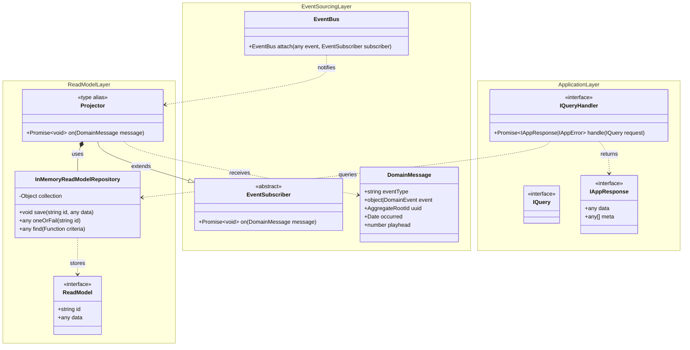
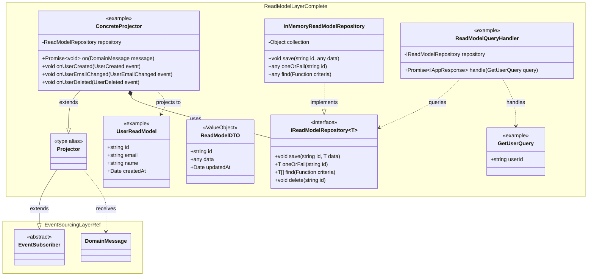

# Read Model Layer - Query Projection Bounded Context

This document describes the Read Model Layer of the Hollywood-JS framework, which provides the infrastructure for building query-optimized read models through event projections.

## Overview

The Read Model Layer implements the "Query" side of CQRS by providing projectors that subscribe to domain events and maintain denormalized read models optimized for query performance.

## UML Class Diagram



## Extended Architecture Diagram



## DDD Pattern Analysis

### Aggregate Root
The Read Model Layer does not define traditional aggregate roots. Instead, projectors act as event handlers that maintain denormalized views.

### Entities
- **Projector**: Abstract base for event-driven read model updaters
  - Inherits EventSubscriber's dynamic method dispatch
  - Methods follow `on{EventType}(event)` naming convention

### Value Objects
- **ReadModelDTO**: Denormalized data structure optimized for queries
- **InMemoryReadModelRepository.collection**: Dictionary of read model instances

### Repository (Infrastructure)
- **InMemoryReadModelRepository**: Simple in-memory storage for read models
  - `save(id, data)`: Upsert operation
  - `oneOrFail(id)`: Fetch with not-found exception
  - `find(criteria)`: Flexible querying with callback filter

## Projection Pattern

```
DomainEvent published to EventBus
         |
         v
EventBus.publish(message)
         |
         v
Projector.on(message)
         |
         v
Dynamic dispatch to on{EventType}(event)
         |
         v
Update ReadModel in Repository
```

## Example Projector Implementation

```typescript
import { EventSubscriber } from 'hollywood-js';
import type { Projector } from 'hollywood-js';

// Projector is a type alias for EventSubscriber - extend EventSubscriber directly
class UserProjector extends EventSubscriber {
    constructor(private readonly repository: InMemoryReadModelRepository) {
        super();
    }

    // Called when UserCreated event is published
    public onUserCreated(event: UserCreated): void {
        this.repository.save(event.userId, {
            id: event.userId,
            email: event.email,
            name: event.name,
            createdAt: new Date()
        });
    }

    // Called when UserEmailChanged event is published
    public onUserEmailChanged(event: UserEmailChanged): void {
        const user = this.repository.oneOrFail(event.userId);
        user.email = event.newEmail;
        this.repository.save(event.userId, user);
    }
}

// The Projector type alias can be used for semantic clarity in type declarations
const projector: Projector = new UserProjector(repository);
```

## Query Handler Integration

```typescript
class GetUserHandler implements IQueryHandler {
    constructor(private readonly repository: InMemoryReadModelRepository) {}

    @autowiring
    public async handle(query: GetUserQuery): Promise<IAppResponse> {
        const user = this.repository.oneOrFail(query.userId);
        return { data: user, meta: [] };
    }
}
```

## Design Decisions

1. **Projector as Type Alias**: Projector is a type alias for EventSubscriber rather than an empty subclass, providing semantic clarity without empty abstraction overhead. To create a projector, extend EventSubscriber directly and use the Projector type alias for documentation/typing purposes.

2. **Convention-Based Dispatch**: Event routing via method names (`on{EventType}`) enables clean, focused handler methods

3. **Simple Repository Interface**: InMemoryReadModelRepository provides essential CRUD without complexity

4. **Flexible Criteria Queries**: The `find(criteria)` method accepts a callback for arbitrary filtering

5. **Eventual Consistency**: Read models are updated asynchronously after events are published

## Query vs Command Model Separation

| Aspect | Command Model | Query Model |
|--------|---------------|-------------|
| Optimized for | Write operations | Read operations |
| Structure | Normalized, aggregate-based | Denormalized, query-specific |
| Consistency | Strong (within aggregate) | Eventual |
| Update mechanism | Direct state mutation | Event projection |
| Storage | EventStore | ReadModelRepository |

## Cross-Context References

- **Projector** is a type alias for **Event Sourcing Layer** EventSubscriber
- **Projector** receives **Domain Layer** DomainMessage/DomainEvent
- Query handlers use **Application Layer** QueryBus
- **Framework Layer** registers projectors with EventBus via ListenerType
