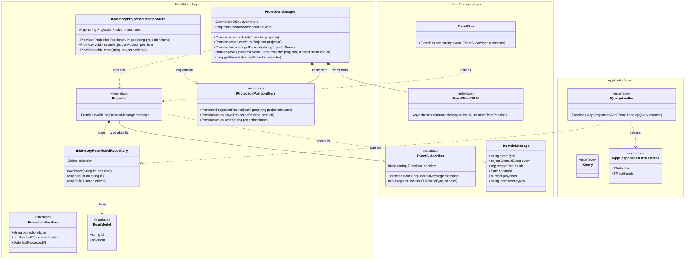

# Read Model Layer - Query Projection Bounded Context

This document describes the Read Model Layer of the Hollywood-JS framework, which provides the infrastructure for building query-optimized read models through event projections.

**Version**: 6.0.0-beta

## Overview

The Read Model Layer implements the "Query" side of CQRS by providing projectors that subscribe to domain events and maintain denormalized read models optimized for query performance.

### v6-beta Changes
- **ProjectionManager**: Orchestrates projection rebuilds and catch-up
- **ProjectionPositionStore**: Tracks projection progress for resumable rebuilds
- **Projector is type alias**: Clarified that Projector is a type alias for EventSubscriber

## UML Class Diagram



## Extended Architecture Diagram


## DDD Pattern Analysis

### Aggregate Root
The Read Model Layer does not define traditional aggregate roots. Instead, projectors act as event handlers that maintain denormalized views.

### Entities
- **Projector** (type alias): EventSubscriber used for read model updates
  - **v6**: Supports explicit handler registration via `registerHandler()`
  - **Legacy**: Methods follow `on{EventType}(event)` naming convention
- **ProjectionManager** (v6): Orchestrates projection rebuilds and catch-up

### Value Objects
- **ReadModelDTO**: Denormalized data structure optimized for queries
- **InMemoryReadModelRepository.collection**: Dictionary of read model instances
- **ProjectionPosition** (v6): Tracks projector progress (name, position, timestamp)

### Repository (Infrastructure)
- **InMemoryReadModelRepository**: Simple in-memory storage for read models
  - `save(id, data)`: Upsert operation
  - `oneOrFail(id)`: Fetch with not-found exception
  - `find(criteria)`: Flexible querying with callback filter

### Interfaces (Ports) - v6
- **IProjectionPositionStore**: Contract for projection position persistence
  - `get(projectionName)`: Retrieve last processed position
  - `save(position)`: Update position
  - `reset(projectionName)`: Reset for full rebuild

## Projection Pattern

```
DomainEvent published to EventBus
         |
         v
EventBus.publish(message)
         |
         v
Projector.on(message)
         |
         v
Handler dispatch (explicit or legacy)
         |
         v
Update ReadModel in Repository
```

## Projection Rebuild Pattern (v6)

```
ProjectionManager.rebuild(projector)
         |
         v
Reset projection position to 0
         |
         v
Stream all events via IEventStoreDBAL.loadAll()
         |
         v
For each event:
  - projector.on(message)
  - Update position in store
         |
         v
Projection fully rebuilt
```

## Projection Catch-Up Pattern (v6)

```
ProjectionManager.catchUp(projector)
         |
         v
Get last processed position from store
         |
         v
Stream events from that position
         |
         v
Process only new events
```

## Example Projector Implementation

```typescript
import { EventSubscriber } from 'hollywood-js';
import type { Projector } from 'hollywood-js';

// v6 Preferred: Explicit handler registration
class UserProjector extends EventSubscriber {
    constructor(private readonly repository: InMemoryReadModelRepository) {
        super();
        this.registerHandler(UserCreated, this.onUserCreated.bind(this));
        this.registerHandler(UserEmailChanged, this.onUserEmailChanged.bind(this));
    }

    private onUserCreated(event: UserCreated): void {
        this.repository.save(event.userId, {
            id: event.userId,
            email: event.email,
            name: event.name,
            createdAt: new Date()
        });
    }

    private onUserEmailChanged(event: UserEmailChanged): void {
        const user = this.repository.oneOrFail(event.userId);
        user.email = event.newEmail;
        this.repository.save(event.userId, user);
    }
}

// The Projector type alias can be used for semantic clarity in type declarations
const projector: Projector = new UserProjector(repository);
```

## Projection Rebuild Example (v6)

```typescript
import { ProjectionManager, InMemoryProjectionPositionStore } from 'hollywood-js';

// Create projection manager
const projectionManager = new ProjectionManager(
    eventStoreDBAL,
    new InMemoryProjectionPositionStore()
);

// Full rebuild (resets position to 0, processes all events)
await projectionManager.rebuild(userProjector);

// Catch-up (resumes from last position)
await projectionManager.catchUp(userProjector);

// Check current position
const position = await projectionManager.getPosition('UserProjector');
console.log(`Processed up to position ${position}`);
```

## Query Handler Integration

```typescript
class GetUserHandler implements IQueryHandler {
    constructor(private readonly repository: InMemoryReadModelRepository) {}

    @autowiring
    public async handle(query: GetUserQuery): Promise<IAppResponse> {
        const user = this.repository.oneOrFail(query.userId);
        return { data: user, meta: [] };
    }
}
```

## Design Decisions

1. **Projector as Type Alias**: Projector is a type alias for EventSubscriber rather than an empty subclass, providing semantic clarity without empty abstraction overhead. To create a projector, extend EventSubscriber directly and use the Projector type alias for documentation/typing purposes.

2. **v6: Explicit Handler Registration**: Preferred approach using `registerHandler()` for type-safe, explicit event routing. Legacy `on{EventType}` methods still work for backwards compatibility.

3. **Simple Repository Interface**: InMemoryReadModelRepository provides essential CRUD without complexity

4. **Flexible Criteria Queries**: The `find(criteria)` method accepts a callback for arbitrary filtering

5. **Eventual Consistency**: Read models are updated asynchronously after events are published

6. **v6: ProjectionManager**: Centralized projection rebuild and catch-up orchestration:
   - Full rebuild from position 0
   - Incremental catch-up from last position
   - Position tracking for resumable operations

7. **v6: Streaming for Rebuilds**: Uses async iterators via `IEventStoreDBAL.loadAll()` for memory-efficient event streaming during rebuilds

8. **v6: Position Tracking**: ProjectionPositionStore tracks per-projector progress, enabling:
   - Resumable rebuilds after failures
   - Incremental catch-up for late-starting projectors
   - Monitoring of projection lag

## Query vs Command Model Separation

| Aspect | Command Model | Query Model |
|--------|---------------|-------------|
| Optimized for | Write operations | Read operations |
| Structure | Normalized, aggregate-based | Denormalized, query-specific |
| Consistency | Strong (within aggregate) | Eventual |
| Update mechanism | Direct state mutation | Event projection |
| Storage | EventStore | ReadModelRepository |

## Cross-Context References

- **Projector** is a type alias for **Event Sourcing Layer** EventSubscriber
- **Projector** receives **Domain Layer** DomainMessage/DomainEvent
- Query handlers use **Application Layer** QueryBus
- **Framework Layer** registers projectors with EventBus via ListenerType
