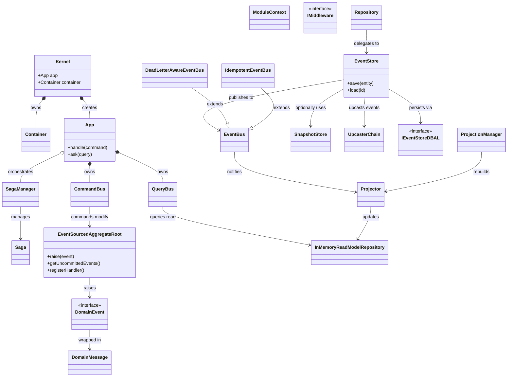

# Hollywood-JS Architecture Overview

Hollywood-JS is a TypeScript framework implementing Event Sourcing, CQRS (Command Query Responsibility Segregation), and Domain-Driven Design patterns.

**Version**: 6.0.0-beta

> **TL;DR:** Hollywood has 5 layers: **Framework** (DI & bootstrapping) → **Application** (commands & queries) → **Domain** (aggregates & events) → **EventSourcing** (persistence) → **ReadModel** (projections). Commands modify aggregates, which emit events, which update read models.

---

## System Architecture Diagram



## Layer Responsibilities

### Framework Layer
**Responsibility**: Application bootstrapping and dependency injection

| Component | Purpose |
|-----------|---------|
| Kernel | Composition root, creates container and app |
| ModuleContext | Module configuration and composition |
| Container (Inversify) | Dependency injection container |

### Application Layer
**Responsibility**: Use case orchestration via CQRS

| Component | Purpose |
|-----------|---------|
| App | Facade for command handling and query asking |
| CommandBus | Routes commands through middleware to handlers |
| QueryBus | Routes queries through middleware to handlers |
| IMiddleware<TMessage, TResponse> | Generic cross-cutting concern hooks (v6) |
| Saga<TState> | Workflow orchestration for long-running processes (v6) |
| SagaManager | Saga lifecycle and event routing (v6) |

### Domain Layer
**Responsibility**: Business logic and event sourcing

| Component | Purpose |
|-----------|---------|
| EventSourcedAggregateRoot | Base for event-sourced domain models with explicit handler registration (v6) |
| Repository<T> | Persistence abstraction with retry support for optimistic locking (v6) |
| DomainEvent | Interface (not abstract class) for domain events (v6) |
| DomainMessage | Event envelope with metadata and idempotency key (v6) |

### Event Sourcing Layer
**Responsibility**: Event persistence and distribution

| Component | Purpose |
|-----------|---------|
| EventStore | Coordinates event persistence, upcasting, and publishing |
| EventBus | Distributes events to subscribers/listeners |
| DeadLetterAwareEventBus | EventBus with failed event handling (v6) |
| IdempotentEventBus | EventBus with duplicate prevention (v6) |
| UpcasterChain | Event version migration (v6) |
| SnapshotStore | Caches aggregate state for performance |
| IEventStoreDBAL | Database abstraction with optimistic locking (v6) |
| ConcurrencyException | Thrown on version conflicts (v6) |

### Read Model Layer
**Responsibility**: Query-optimized projections

| Component | Purpose |
|-----------|---------|
| Projector (type alias) | Type alias for EventSubscriber used in read model context |
| ProjectionManager | Projection rebuild and catch-up orchestration (v6) |
| ProjectionPositionStore | Tracks projection progress (v6) |
| InMemoryReadModelRepository | Simple read model storage |

## Data Flow

### Command Flow (Write Path)
```
Client -> App.handle(command)
       -> CommandBus.handle(command)
       -> Middleware chain
       -> CommandHandlerResolver.execute(command)
       -> CommandHandler.handle(command)
       -> Repository.save(aggregate)
       -> EventStore.save(aggregate)
       -> DBAL.append(events)
       -> EventBus.publish(events)
       -> Projector.on(event)
       -> ReadModel updated
```

### Query Flow (Read Path)
```
Client -> App.ask(query)
       -> QueryBus.ask(query)
       -> Middleware chain
       -> QueryHandlerResolver.execute(query)
       -> QueryHandler.handle(query)
       -> ReadModelRepository.find(criteria)
       -> Response returned
```

## Bounded Contexts

The framework is organized into five bounded contexts:

1. **[Application Layer](bounded-contexts/application-layer.md)** - CQRS implementation
2. **[Domain Layer](bounded-contexts/domain-layer.md)** - Event Sourcing primitives
3. **[Event Sourcing Layer](bounded-contexts/event-sourcing-layer.md)** - Persistence infrastructure
4. **[Framework Layer](bounded-contexts/framework-layer.md)** - DI and bootstrapping
5. **[Read Model Layer](bounded-contexts/read-model-layer.md)** - Query projections

## DDD Building Blocks Used

| Building Block | Examples in Hollywood-JS |
|----------------|--------------------------|
| Aggregate Root | EventSourcedAggregateRoot, EventStore, Kernel, App |
| Entity | EventSourced, ModuleContext, Saga<TState> |
| Value Object | DomainEvent (interface), DomainMessage, ICommand, IQuery, SagaStateSnapshot |
| Repository | Repository<T>, IRepository<T>, ISagaRepository |
| Domain Service | CommandBus, QueryBus, EventBus, SagaManager, ProjectionManager |
| Factory | AppBuilder, HollywoodModule, SagaFactory |
| Domain Event | DomainEvent (interface with optional version field) |

## Key Design Patterns

### 1. Middleware Chain Pattern
Both CommandBus and QueryBus support generic middleware for cross-cutting concerns:
```typescript
// v6: Generic middleware with type-safe message and response types
interface IMiddleware<TMessage, TResponse> {
    execute(message: TMessage, next: NextMiddleware<TMessage, TResponse>): Promise<TResponse>;
}
```

### 2. Event Sourcing with Explicit Handler Registration (v6)
Aggregates capture all state changes as events with explicit handler registration:
```typescript
class User extends EventSourcedAggregateRoot {
    constructor(id: string) {
        super(id);
        // v6: Explicit handler registration (preferred)
        this.registerHandler(UserCreated, this.applyUserCreated.bind(this));
    }

    private applyUserCreated(event: UserCreated): void {
        this.email = event.email;
    }
}
```

### 3. CQRS with Type-Safe Responses (v6)
Strict separation of command (write) and query (read) paths:
- Commands return `void` or error
- Queries return typed `IAppResponse<TData, TMeta>` or error

### 4. Ports and Adapters
Infrastructure interfaces (ports) with swappable implementations (adapters):
- `IEventStoreDBAL` -> `InMemoryEventStore`
- `ISnapshotStoreDBAL` -> `InMemorySnapshotStoreDBAL`
- `IIdempotencyStore` -> `InMemoryIdempotencyStore` (v6)
- `IDeadLetterQueue` -> `InMemoryDeadLetterQueue` (v6)
- `IProjectionPositionStore` -> `InMemoryProjectionPositionStore` (v6)
- `ISagaRepository` -> `InMemorySagaRepository` (v6)

### 5. Projection Pattern
Events are projected to denormalized read models (Projector is a type alias for EventSubscriber):
```typescript
// v6: Explicit handler registration in projectors
class UserProjector extends EventSubscriber {
    constructor(private repository: UserReadModelRepository) {
        super();
        this.registerHandler(UserCreated, this.onUserCreated.bind(this));
    }

    private onUserCreated(event: UserCreated): void {
        this.repository.save(event.userId, { ... });
    }
}
```

### 6. Event Versioning and Upcasting (v6)
Events support schema evolution through version migrations:
```typescript
const chain = new UpcasterChain();
chain.register({
    eventType: 'UserCreated',
    fromVersion: 1,
    toVersion: 2,
    upcast: (event) => ({ ...event, email: event.email || '', version: 2 })
});
```

### 7. Saga/Process Manager Pattern (v6)
Long-running processes across multiple aggregates:
```typescript
class OrderFulfillmentSaga extends Saga<OrderState> {
    readonly sagaType = 'OrderFulfillmentSaga';

    static startedBy(): string[] {
        return ['OrderPlaced'];
    }

    protected getEventHandlers(): Map<string, (event: any) => Promise<void>> {
        return new Map([
            ['OrderPlaced', this.onOrderPlaced.bind(this)],
            ['PaymentReceived', this.onPaymentReceived.bind(this)],
        ]);
    }
}
```

### 8. Dead Letter Queue Pattern (v6)
Failed events are captured for later analysis and retry:
```typescript
const eventBus = new DeadLetterAwareEventBus(
    deadLetterQueue,
    RetryPolicy.default() // Exponential backoff with 3 retries
);
```

### 9. Idempotent Event Processing (v6)
Duplicate event prevention at the bus level:
```typescript
const eventBus = new IdempotentEventBus(idempotencyStore, {
    ttl: 3600000, // 1 hour
    onDuplicate: (msg) => console.log('Duplicate detected:', msg.idempotencyKey)
});
```

### 10. Optimistic Locking (v6)
Concurrency control with version-based conflict detection:
```typescript
// Repository provides retry support for optimistic locking conflicts
await repository.saveWithRetry(aggregateId, (aggregate) => {
    aggregate.updateEmail(newEmail);
}, maxRetries);
```

## Technology Stack

- **Language**: TypeScript 5.9 (v6)
- **Runtime**: Node.js 20/22 LTS (v6)
- **DI Container**: Inversify
- **Metadata**: reflect-metadata
- **Configuration**: config
- **Testing**: Jest 30 (v6)
- **Linting**: ESLint 9 (replaced TSLint) (v6)

## Getting Started

```typescript
// 1. Define your module
const MyModule = new ModuleContext({
    commands: [CreateUserHandler],
    queries: [GetUserHandler],
    services: new Map([
        ['UserRepository', { instance: UserRepository }]
    ])
});

// 2. Create kernel
const kernel = await Kernel.createFromModuleContext(
    'production',
    parameters,
    MyModule
);

// 3. Use the app
await kernel.app.handle(new CreateUser(userId, email));
const user = await kernel.app.ask(new GetUser(userId));
```

## Further Reading

- [Application Layer Details](bounded-contexts/application-layer.md)
- [Domain Layer Details](bounded-contexts/domain-layer.md)
- [Event Sourcing Layer Details](bounded-contexts/event-sourcing-layer.md)
- [Framework Layer Details](bounded-contexts/framework-layer.md)
- [Read Model Layer Details](bounded-contexts/read-model-layer.md)
- [Architecture Decision Log](ARCHITECTURE_LOG.md)
