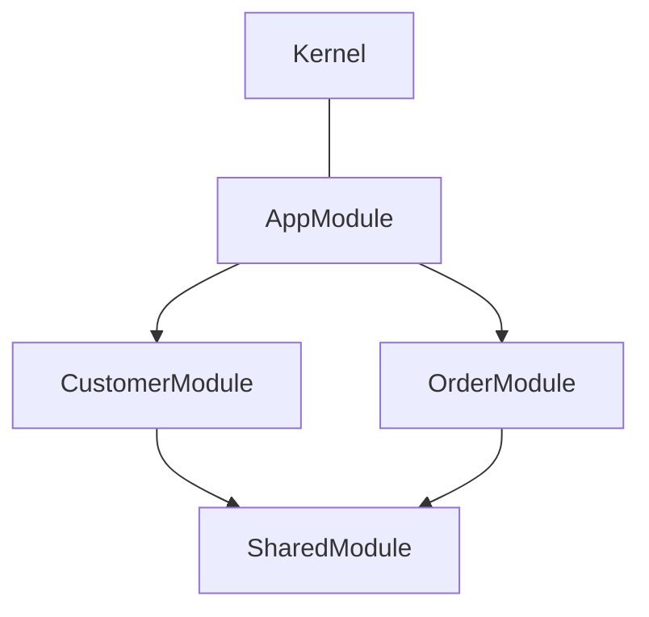

# Dependency Injection

Hollywood uses [Inversify](https://github.com/inversify/InversifyJS) for dependency injection. ModuleContext provides a clean API for defining service hierarchies.

## ModuleContext

A `ModuleContext` defines a boundary for related services. In DDD terms, it represents a module within a bounded context.

```typescript
import { Framework } from "hollywood-js";

export const CustomerModule = new Framework.ModuleContext({
    commands: [CreateCustomerHandler],
    queries: [GetCustomerByIdHandler],
    services: new Map()
        .set("customer.repository", { instance: CustomerRepository }),
    modules: [SharedModule],  // Dependencies on other modules
});
```

## Service Types

### Standard Type

Basic class instantiation:

```typescript
const services = new Map()
    .set("logger", { instance: Logger });
```

### Async Type

For services requiring async initialization:

```typescript
async function createDatabaseConnection() {
    const connection = new PostgresClient(config);
    await connection.connect();
    return connection;
}

const services = new Map()
    .set("database.connection", { async: createDatabaseConnection });
```

### Collection Type

Group multiple services under one alias:

```typescript
const services = new Map()
    .set("pricing.strategies", {
        collection: [CouponStrategy, B2BStrategy, BulkStrategy],
    });
```

### Custom Type

Factory functions for complex initialization:

```typescript
const services = new Map()
    .set("custom.service", {
        custom: () => createCustomService(config.get("custom.config")),
    });
```

### EventStore Type

Define an EventStore for an AggregateRoot:

```typescript
const services = new Map()
    .set("user.eventStore", { eventStore: User });
```

## Module Dependencies

Modules can depend on other modules:



```typescript
const SharedModule = new Framework.ModuleContext({
    services: new Map()
        .set("logger", { instance: Logger }),
});

const CustomerModule = new Framework.ModuleContext({
    services: new Map()
        .set("customer.repository", { instance: CustomerRepository }),
    modules: [SharedModule],
});

const AppModule = new Framework.ModuleContext({
    services: new Map(),
    modules: [CustomerModule, OrderModule],
});
```

## Injecting Dependencies

Use Inversify decorators to inject services:

```typescript
import { inject, injectable } from "inversify";

@injectable()
class CustomerService {
    constructor(
        @inject("customer.repository") private readonly repository: CustomerRepository,
        @inject("logger") private readonly logger: Logger,
    ) {}
}
```

## Injecting Parameters

Parameters are injected the same way as services:

```typescript
// config/index.ts
export const parameters = new Map([
    ["database.host", process.env.DB_HOST || "localhost"],
    ["database.port", parseInt(process.env.DB_PORT || "5432")],
]);

// Usage in service
@injectable()
class DatabaseConnection {
    constructor(
        @inject("database.host") private readonly host: string,
        @inject("database.port") private readonly port: number,
    ) {}
}
```

## Kernel Bootstrap

The Kernel creates the container from your module tree:

```typescript
import { Framework } from "hollywood-js";
import { parameters } from "./config";
import { AppModule } from "./modules/app-module";

export async function KernelFactory(): Promise<Framework.Kernel> {
    return Framework.Kernel.createFromModuleContext(
        process.env.NODE_ENV || "dev",
        parameters,
        AppModule
    );
}
```

## Accessing the Container

```typescript
const kernel = await KernelFactory();

// Get a service
const logger = kernel.container.get<Logger>("logger");

// Execute commands/queries
await kernel.app.handle(new CreateCustomer(...));
const result = await kernel.app.ask(new GetCustomer(...));
```

## Built-in Services

Hollywood provides these services by default:

| Alias | Description |
|-------|-------------|
| `hollywood.infrastructure.eventBus.default` | Default EventBus |
| `hollywood.infrastructure.eventStore.dbal.default` | Default EventStore DBAL |
| `hollywood.infrastructure.eventStore.snapshot.default` | Default Snapshot service |

---

**Next:** [Sagas & Process Managers](../advanced/sagas.md)
