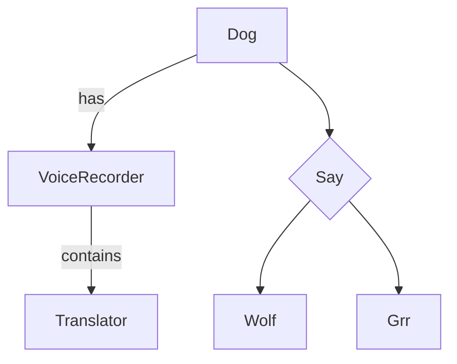

# Event Sourcing

Hollywood provides built-in event sourcing capabilities. Those lives in the **EventSourcing** module.

It includes:

- EventSourced entity abstraction
- EventSourcedAggregateRoot entity abstraction
- Event Store
- Snapshot Store 
- Event Bus & Listeners
- *Sometime soon*: Sagas

> Hollywood does not provide any other official Storage than InMemory yet. Exist plans for MongoDB and Postgresql (which I've examples for)

# Drive by example: Modeling Dogs in Up film

In the [Up film from Pixar](https://en.wikipedia.org/wiki/Up_(2009_film)), the dogs have a mechanism that records and translates to human language.

Let's draw:



In Typescript:

## Events

```typescript
export class SayWolf extends DomainEvent {
    constructor(public readonly dogId: DogId) {
        super();
    }
}

export class SayGrr extends DomainEvent {
    constructor(public readonly dogId: DogId) {
        super();
    }
}
```

## Entities & Aggregates child entities

```typescript
class Translator extends EventSourced {
    public translations: string[] = [];

    public applySayWolf(event: SayWolf) {
        this.translations.push('Hey dude!');
    }
    public applySayGrr(event: SayGrr) {
        this.translations.push('I. Don\'t. Like. That... RUN!');
    }
}

class VoiceRecorder extends EventSourced {
    public recorded: string[] = [];
    private readonly translator: Translator;
    constructor() {
        super();
        this.registerChildren(this.translator = new Translator())
    }

    public applySayWolf(event: SayWolf) {
        this.recorded.push('Wolf');
    }

    public getLastTranslation(): string {
        return this.translator.translations.slice(-1).pop();
    }
}
```

## AggregateRoot

> When an event is *raised* inside an *EventSourced* entity, the entity will look for a method that prefix with *apply* the DomainEvent name on the entity and his different childs.

```typescript
class Dog extends EventSourcedAggregateRoot {
    public wolfCount: number = 0;
    private readonly voiceRecorder: VoiceRecorder;
    constructor(id = '41') {
        super(id);
        this.registerChildren(this.voiceRecorder = new VoiceRecorder())
    }

    public sayWolf(): string {
        super.raise(new SayWolf(this.getAggregateRootId()));

        return this.voiceRecorder.getLastTranslation();
    }

    public sayGrr(): string {
        super.raise(new SayGrr(this.getAggregateRootId()));

        return this.voiceRecorder.getLastTranslation();
    }

    public applySayWolf(event: SayWolf) {
        this.wolfCount++;
    }
    
    public getLastTranslation(): string {
        return this.voiceRecorder.getLastTranslation();
    }
}
```

# Event Store

Hollywood provides an *InMemoryEventStore* but also the necessary Interfaces to create your own Database Abstraction Layer (DBAL).

> You can find an example of a Postgresql EventStoreDBAL and SnapshotStoreDBAL in this [repository](https://github.com/jorge07/billing-api/blob/master/src/Billing/Shared/Infrastructure/EventStore/DBAL.ts)

```typescript
const store = new EventStore<Dog>(Dog, new InMemoryEventStore(), new EventBus());
const Dug = new Dog("1");

console.log(Dug.sayWolf());
// 'Hey dude!'

expect(Dug.version()).toBe(1);

await store.save(Dug);

// Clone Dug
const newDug: Dog = await store.load(Dug.getAggregateRootId()); // The Event Store is able to reconstruct the Aggregate.
expect(newDug.wolfCount).toBe(1);
expect(newDug.version()).toBe(1);
expect(newDug.getLastTranslation()).toBe('Hey dude!');
```

> As mentioned in the [Listeners page](concepts/event-listeners.md), Listeners and Subscribers can be attached to the **EventBus** to execute any action after events are persisted.

# Snapshot Store

In certain Event Sourcing systems, the *Events* volume grow quite fast and in consequence the queries and the time require to reconstruct the Aggregate from the events, can grow exponentially.
There're some mechanisms we can use to mitigate this, such use an Event Store per stream, with the time we may end having the same problem.

The Snapshot Store provides a way to limit the number of events we're going to reconstruct our aggregate from.
It does that defining a **Snapshot Margin** to *take a picture* of the Aggregate after certain amount of versions and each N versions it will overwrite the previous one.

In an Aggregate with 300 events in the event store, the Event Store will need to apply this 300 events to each entity of the aggregate and this is not efficient.
A **Snapshot Margin** of 5 versions will remove at least *295 * N entities* iterations to reconstruct the aggregate.

The Snapshot Store is an optional dependencies of the *Event Store* and the default **Snapshot Margin** is 10.
