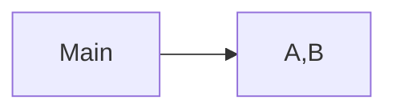
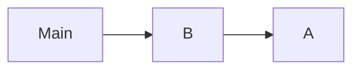
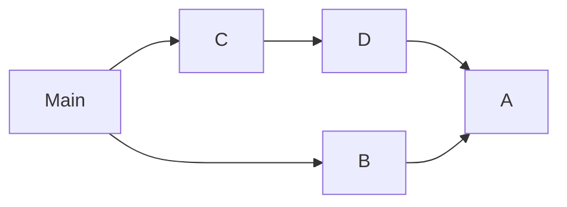
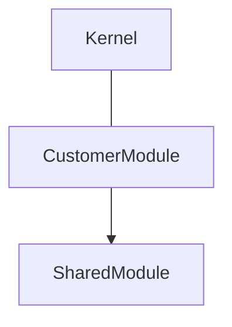
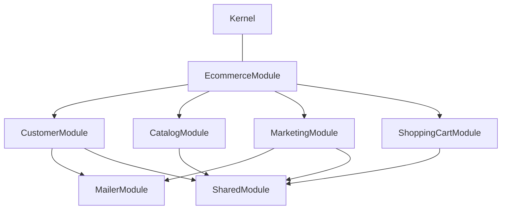
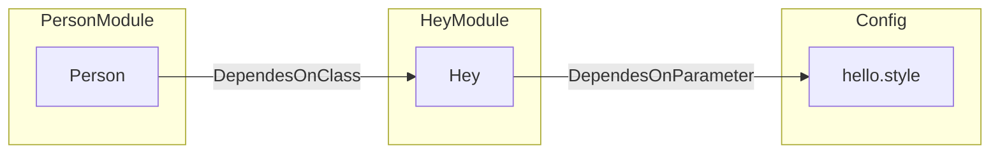

# ModuleContext

A ModuleContext stand for a Bounded Context in DDD terms.

The reason behind is to define boundaries in the scope of a particular problem.

A Module Context in Hollywood context defines:

- Commands available in that Bounded Context. (A.K.A. Mutations)
- Queries available in that Bounded Context.
- Services, the bounded context services list for the container.
- Modules you depend on. An example of this is a SharedModule with Logger, metrics, db connections and other horizontal dependencies.

See:
```typescript
// src/Framework/Modules/ModuleContext.ts
export interface ModuleConfig {
    commands?: any[]
    queries?: any[]
    services: ServiceList
    modules?: ModuleContext[]
}
```

### Module Hierarchy

Modules can have depend on other modules. There're some kind of dependencies

**Single level dependency**

Your module depends on 1 or more dependencies that don't depend on others.



```typescript
import ModuleContext from "./module-context";

const ModuleA = new ModuleContext({service, commands, queries})
const ModuleB = new ModuleContext({service, commands, queries})
const mainModule = new ModuleContext({service, commands, queries, modules: [ModuleA, ModuleB]})
```

**Multi level dependencies**

Your module depends on 1 or more dependencies that depends on 1 or more modules.


or 

```typescript
import ModuleContext from "./module-context";

const ModuleA = new ModuleContext({service, commands, queries})
const ModuleB = new ModuleContext({service, commands, queries, module: [ModuleA]})
const mainModule = new ModuleContext({service, commands, queries, modules: [ModuleB]})
```

### Drive by example

Following the Guide, the next step will be create your first Domain Bounded Context module.
Let's say it's `CustomerModule`, your structure will look like:



In an E-Commerce business, you'll need to add other Modules, like `Catalog`, `ShoppingCart`, `Marketing`... where some dependencies may be shared.
Let's draw an example:



In the above example, some modules contain more than one dependency and there's a top level dependency call `EcommerceModule`.

### Why do this?

By doing this we enforce isolation and simplify our unit tests suites a lot.
We can even instantiate the entire Kernel just with the module we want to test, ensuring no side-effects caused by third-party (We'll catch this in other later, not in our unit tests).

### A Module Dependency Example

Dependency Graph




```typescript
import ModuleContext from "./ModuleContext";
import Kernel from "./Kernel";
import {inject} from "inversify";

const parameters = new Map([
  ['hello.style', 'hey']
]);

class Hey {
  constructor(@inject('hello.style') private readonly style: string) {}

  hello(): string {
    return this.style
  }
}

const HeyModule = new ModuleContext({
  services: [
    ['hey', {instance: Hey}]
  ]
})

class Person {
    constructor(@inject('hey') private readonly hey: Hey) {}

    sayHello(): string {
        return this.key.hello()
    }
}

const PersonModule = new ModuleContext({
  services: [
    ['person', {instance: Person}]
  ],
  modules: [HeyModule]
})
const kernel = new Kernel('dev', true, parameters, PersonModule);

kernel.container.get<Person>('person').sayHello() // 'key'
```
