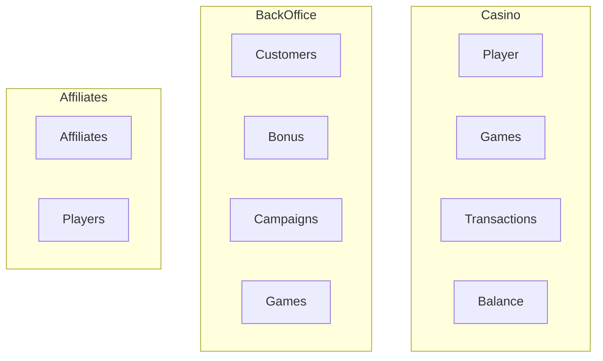
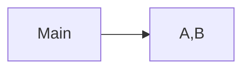
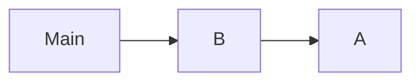
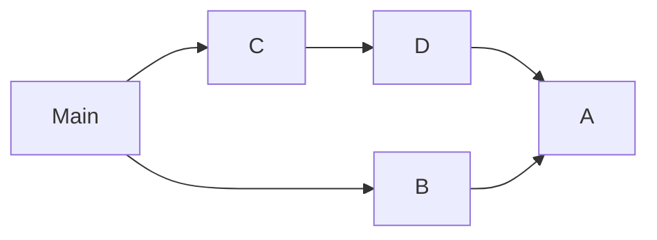
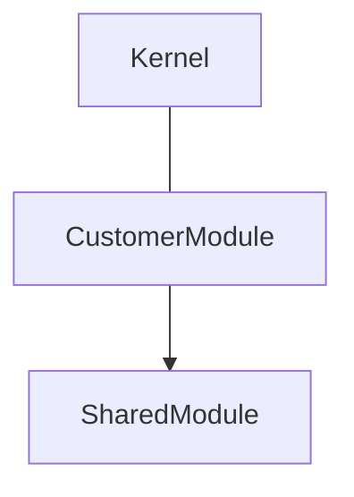
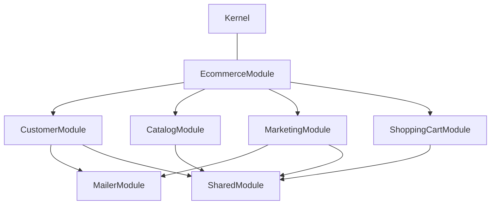
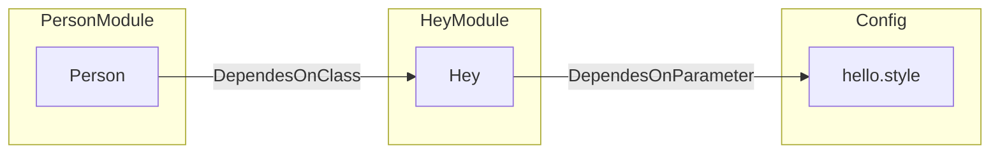

# ModuleContext

## What's a Module

A **Module** (*module* is a reserved word in NodeJS) represents, in DDD terms, an space for related concepts inside a **Bounded Context**.


Let's see the example below:



In a Gambling company we've 3 different Bounded Contexts:

- **Casino**. Where the business occurs. Core Business.
- **BackOffice**. Where the business gets administrated. Core Business.
- **Affiliate**. Were we take users from. It's an important part of the business, but we're not experts, we may buy a solution instead build our own.

This Bounded Contexts has different **Modules** inside:

- Affiliate Player, Affiliates, Customer, BackOffice Player, Casino Games... etc

#### Why do we prefix each with the **Bounded Context**?

A **Module** with the same *name* can be totally different on different **Bounded Contexts**.

See as example:

**Affiliate Player** VS **Casino Player**

For an **Affiliate** system, a **Player** as *Entity* is different from a **Player** in the **Casino** Bounded Context.

- In the *Affiliate Bounded Context*: a Player can't play, can't withdraw, can't contact support...
- In the *Casino Bounded Context*: a Player we don't care about *referer links* or related.

> The reason behind aModule is to define boundaries in the scope of a particular aggregate. General rule: 1 Aggregate - 1 Module.

## A Module in Hollywood-js 

**ModuleContext** can be used as DDD Modules and also as an isolation form for features that may promote or not in the future to his own Module.

A Module Context in Hollywood context defines:

- **Commands**: Available mutations on the state managed by the Module.
- **Queries**: To retrieve available information owned by the Module.
- **Services**: The services list that compose the Module. Available later in the container.
- **Modules**: Modules it depends on. An example of this is a `SharedModule` with `Logger`, `Metrics`, `db connections` and other horizontal dependencies.

```typescript
// src/Framework/Modules/ModuleContext.ts
export interface ModuleConfig {
    commands?: any[]
    queries?: any[]
    services: ServiceList
    modules?: ModuleContext[]
}
```

### Module Hierarchy

Modules can have depend on other modules. There're some kind of dependencies

**Single level dependency**

Your module depends on 1 or more dependencies that don't depend on others.



```typescript
import ModuleContext from "./module-context";

const ModuleA = new ModuleContext({service, commands, queries})
const ModuleB = new ModuleContext({service, commands, queries})
const mainModule = new ModuleContext({service, commands, queries, modules: [ModuleA, ModuleB]})
```

**Multi level dependencies**

Your module depends on 1 or more dependencies that depends on 1 or more modules.


or 

```typescript
import ModuleContext from "./module-context";

const ModuleA = new ModuleContext({service, commands, queries})
const ModuleB = new ModuleContext({service, commands, queries, module: [ModuleA]})
const mainModule = new ModuleContext({service, commands, queries, modules: [ModuleB]})
```

### Drive by example

Following the Guide, the next step will be create your first Domain Bounded Context module.
Let's say it's `CustomerModule`, your structure will look like:



In an E-Commerce business, you'll need to add other Modules, like `Catalog`, `ShoppingCart`, `Marketing`... where some dependencies may be shared.
Let's draw an example:



In the above example, some modules contain more than one dependency and there's a top level dependency call `EcommerceModule`.

### Why do this?

By doing this we enforce isolation and simplify our unit tests suites a lot.
We can even instantiate the entire Kernel just with the module we want to test, ensuring no side-effects caused by third-party (We'll catch this in other later, not in our unit tests).

Another benefit of isolation is reutilization. A Module can be exposed as npm package and distributed across different projects.

### A Module Dependency Example

Dependency Graph




```typescript
import ModuleContext from "./ModuleContext";
import Kernel from "./Kernel";
import {inject} from "inversify";

const parameters = new Map([
  ['hello.style', 'hey']
]);

class Hey {
  constructor(@inject('hello.style') private readonly style: string) {}

  hello(): string {
    return this.style
  }
}

const HeyModule = new ModuleContext({
  services: [
    ['hey', {instance: Hey}]
  ]
})

class Person {
    constructor(@inject('hey') private readonly hey: Hey) {}

    sayHello(): string {
        return this.key.hello()
    }
}

const PersonModule = new ModuleContext({
  services: [
    ['person', {instance: Person}]
  ],
  modules: [HeyModule]
})
const kernel = new Kernel('dev', true, parameters, PersonModule);

kernel.container.get<Person>('person').sayHello() // 'key'
```
