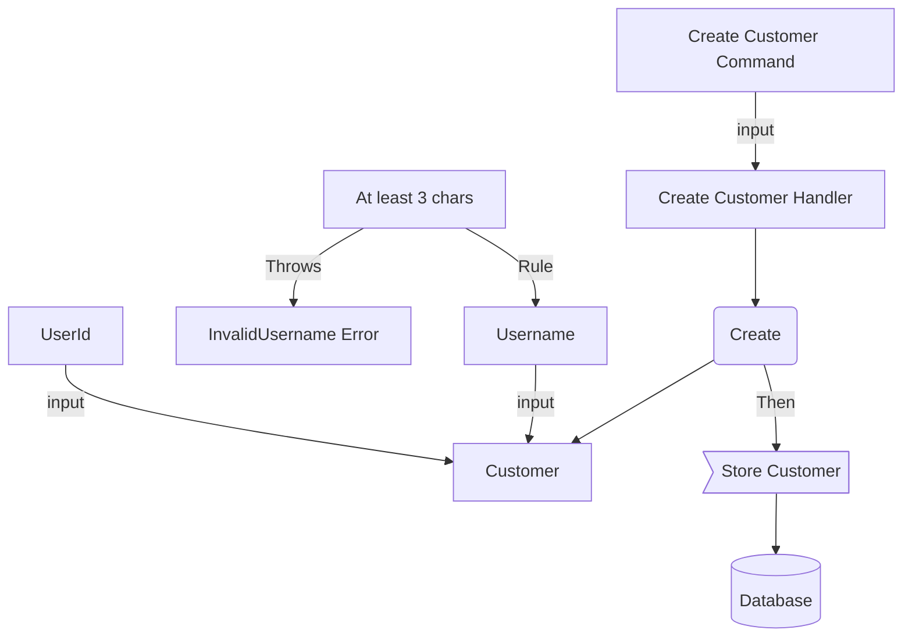

# First Business Module

> The following example can be found on the examples folder in the repository: Chapter 3.

Now that we've created our first [Module](concepts/module-context.md) it's time to create the first one with some business logic inside.
We're going to work on to of our previous SharedModule and structure will look like this:

# Business Logic


```gherkin
Feature: Customer registration
  
  Scenario: Create a valid Customer and store it in the db
    Given a userId: "fake-uuid" and username "Jorge"
    When Customer is requested to be created
    Then a Customer is registered in the database
    And no exception is thrown or response received

  Rule: Username is only valid when has at least 3 characters

      Scenario: An invalid username "A" should be rejected
        Given a userId: 'fake-uuid' and username: 'A'
        When Customer is requested to be created
        Then an InvalidUsername Error should be thrown

      Scenario: An invalid username "AA" should be rejected
        Given a userId: 'fake-uuid' and username: 'AA'
        When Customer is requested to be created
        Then an InvalidUsername Error should be thrown
```

What we extract from here is:



## Summary

- **Value objects**
  - Username
  - UserId
- **Entity**
   - Customer
- **Errors**
    - InvalidUsername
- **Use Case**
    - Create Customer
- **Infrastructure**
    - Database (In our case, InMemory)

# Starting with what matters: Business

Let's start from the beginning: **What to do?** -> Create Customer

## Use Case: Create Customer

We're going to receive 2 primitives:

- userId
- username

```typescript
// src/modules/customer/application/command/create/command.ts

import type { Application } from "hollywood-js";

export default class CreateCommand implements Application.ICommand {
  constructor(
          public readonly userId: string,
          username: string,
  ) {}
}
```

Commands in Hollywood are defined with a marker **Interface**: **ICommand**. 

This command will be sent to the **CommandBus** to be handled by a **CommandHandler**.

From this outside, we're going to consume it like this:

```typescript
import ...
(async () => {
    const kernel = await KernelFactory();
   
    const uuid = "uuid-fake";
    await kernel.app.handle(new CreateCommand(uuid, "Valid-Username"))
})()
```

The **CommandBus** will map your commands to a CommandHandler we're going to create: ***CreateHandler*

```typescript
import { Application } from "hollywood-js";
import type {IAppError} from "hollywood-js/src/Application/Bus/CallbackArg";
import {injectable} from 'inversify';
import CreateCommand from "./command";

@injectable()
export default class CreateHandler implements Application.ICommandHandler {
    constructor(private readonly repository: SomeRepository) {}

    // This **autowiring** annotation is what maps the Handler with the Command in the Command bus by decoreating the Handler
    @Application.autowiring 
    public async handle(command: CreateCommand): Promise<void | IAppError> {
        // TODO Create Customer, then save it.
        const customer = ...;
        await this.repository.save(customer);
    }
}
```

For now, this is enough, time to jump into the **Domain Layer**

# Domain

## Username

If Username less than 3 charts, InvalidUsername Error.

```typescript
// src/modules/customer/domain/error/invalid-username.ts

export class InvalidUsername extends Error {
    constructor(username: string, reason: string) {
        super(`InvalidUsername: ${username}. Reason: ${reason}`);
    }
}
```

Username should be self-aware of his rules:

```typescript
// src/modules/customer/domain/value-object/username.ts

import { InvalidUsername } from "../error/invalid-username";

export class Username {
    public readonly value: string;

    public static fromLiteral(username: string): Username {
        return new Username(username);
    }

    private constructor(username: string) {
        Username.validate(username);
        this.value = username;
    }

    private static validate(username: string) {
        if (username.length < 3) {
            throw new InvalidUsername(username, 'Username should container at least 3 characters');
        }
    }
}
```

By validating in the **constructor** we make sure only **valid** Username objects can live in our application.

## Customer

The customer is only a container for UserId and Username it can only be created by passing a valid Username.

```typescript
// src/modules/customer/domain/customer.ts

import type { Username } from "./value-object/username";

export class Customer {
    constructor(public readonly userId: string, public readonly username: Username) {}
}
```

## Database

The user story talks about store the user so we're going to create a repository in domain for the cases we've.

```typescript
// src/modules/customer/domain/repository.ts

import type { Customer } from "./customer";

export interface CustomerRepository {
  getOneOfFail(userId: string): Promise<Customer>;
  save(customer: Customer): Promise<void>
}
```

At this point our **Domain** Layer knows about:

- Customer
- Customer creation rules
- Some Storage, doesn't case about which one.

# Infrastructure

It's time now to implement this storage layer. We're going to use InMemory but feel free to use whatever you need (Postgresql, MongoDB, etc.)

Hollywood provides an **InMemoryReadModelRepository** for testing and prototyping purposes, so let's use it and implement our CustomerRepository **interface**

```typescript
// src/modules/customer/infrastructure/read-model/in-memory-repository.ts

import { ReadModel } from "hollywood-js";
import type { CustomerRepository } from "../../domain/repository";
import type {Customer} from "../../domain/customer";

export class InMemoryRepository implements CustomerRepository {
  private readonly dbal: ReadModel.InMemoryReadModelRepository;

  constructor() {
    this.dbal = new ReadModel.InMemoryReadModelRepository();
  }

  async getOneOfFail(userId: string): Promise<Customer> {
    return await this.dbal.oneOrFail(userId);
  }

  async save(customer: Customer): Promise<void> {
    await this.dbal.save(customer.userId, customer);
  }
}
```

# Application Layer

We're back to the **Application** layer we're we're going to finish the Use Case.

Let's start with the **CreateCommand** and hydrate the primitive with a **Username** object, so we ensure integrity and return earlier is fails as Command isn't valid then. 

```typescript
// src/modules/customer/application/command/create/command.ts

import type { Application } from "hollywood-js";
import { Username } from "../../../domain/value-object/username"; // Import Username

export default class CreateCommand implements Application.ICommand {
    public readonly username: Username;
    constructor(
        public readonly uuid: string,
        username: string,
    ) {
        this.username = Username.fromLiteral(username); // Hydrate username from here
    }
}
```

Time to finish the **CreateHandler**

```typescript
// src/modules/customer/application/command/create/handler.ts

import { Application } from "hollywood-js";
import type {IAppError} from "hollywood-js/src/Application/Bus/CallbackArg";
import {inject, injectable} from 'inversify';
import CreateCommand from "./command";
import {Customer} from "../../../domain/customer";
import {CustomerRepository} from "../../../domain/repository";

@injectable()
export default class CreateHandler implements Application.ICommandHandler {
    constructor(@inject("customer.repository") private readonly repository: CustomerRepository) {}

    @Application.autowiring
    public async handle(command: CreateCommand): Promise<void | IAppError> {
        const customer = new Customer(command.uuid, command.username);
        await this.repository.save(customer);
    }
}

```

# Customer Module

Here we define our Module and dependency tree

```typescript
// src/modules/customer/infrastructure/customer-module.ts

import {Framework} from "hollywood-js";
import {InMemoryRepository} from "./read-model/in-memory-repository";
import {SharedModule} from "../../shared/infrastructure/shared-module";
import CreateHandler from "../application/command/create/handler";

const services = (new Map())
        .set("customer.repository", { instance: InMemoryRepository })
;
export const CustomerModule = new Framework.ModuleContext({
  commands: [
    CreateHandler
  ],
  services,
  modules: [
    // SharedModule can be imported here in case we want to inject logger somewhere.
  ]
});
```

# The Kernel

We'll do the binding for our configuration and application.

```typescript
// src/kernel.ts
import { parameters } from "../config";
import { Framework } from "hollywood-js";
import { CustomerModule } from "./modules/customer/infrastructure/customer-module";

export default async function KernelFactory(): Promise<Framework.Kernel> {
  return Framework.Kernel.createFromModuleContext(
          process.env.NODE_ENV || 'dev',
          parameters,
          CustomerModule,
          new Map<string,any>()
  );
}

```

# Run the example

Let's run this:

```typescript
// createCustomer.ts

import "reflect-metadata";
import type { ILog } from "./src/modules/shared/infrastructure/audit/logger";
import KernelFactory from "./src/kernel";
import CreateCommand from "./src/modules/customer/application/command/create/command";

(async () => {
  const kernel = await KernelFactory();
  const logger = kernel.container.get<ILog>("logger");

  const uuid = "uuid-fake";
  await kernel.app.handle(new CreateCommand(uuid, "Valid-Username"))
  logger.warn(`User created with uuid: ${uuid}`);
})()

```

```bash
$ ./node_modules/.bin/tsc
```

```bash
$ node createCustomer.js
{"message":"User created with uuid: uuid-fake","level":"warn"}

```


# Structure

This is the final structure you can find in examples folder in the repository for guide/chapter-3

```bash
chapter-3
├── config
│   └── index.ts
├── createCustomer.ts
├── package.json
├── src
│   ├── kernel.ts
│   └── modules
│       ├── customer
│       │   ├── application
│       │   │   └── command
│       │   │       └── create
│       │   │           ├── command.ts
│       │   │           └── handler.ts
│       │   ├── domain
│       │   │   ├── customer.ts
│       │   │   ├── error
│       │   │   │   └── invalid-username.ts
│       │   │   ├── repository.ts
│       │   │   └── value-object
│       │   │       └── username.ts
│       │   └── infrastructure
│       │       ├── read-model
│       │       |    └── in-memory-repository.ts
│       │       └── customer-module.ts
│       └── shared
│           └── infrastructure
│               ├── audit
│               │   └── logger.ts
│               └── shared-module.ts
├── tsconfig.json
└── yarn.lock
```

# Help?

> Found any issue? Want some clarification? Open an issue [here](https://github.com/jorge07/hollywood/issues/new/choose) please
